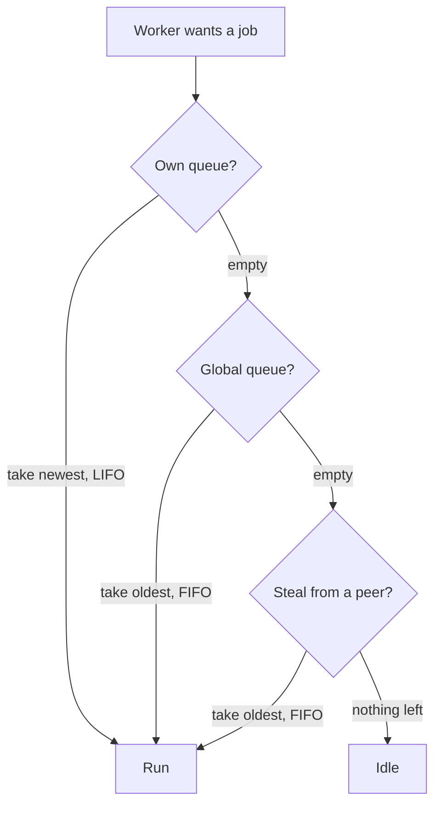

> [!summary]
> Threads let a program do more than one thing at a time, but they are not free — each carries about 1 MB of stack, costs a system call to start, and costs the CPU time every time the scheduler moves it. So .NET does not hand you a thread per job. It keeps a **thread pool**: a standing crew of threads that stay alive and pick up work as it arrives. `Task.Run`, every `await` continuation, timer and I/O callbacks all land here. Understand how the pool behaves and you can explain why a service scales smoothly or falls over under load.

## The Thread and the Scheduler

A CPU core does one thing: read an instruction, run it, move to the next. A **thread** is that moving position plus the state needed to pause and resume it — a **stack** holding its local variables and call chain, and **registers** that hold, among other things, the address of the next instruction.

The OS keeps the list of threads and decides which core runs which, and for how long. Because there are always more threads than cores, a core cannot run them all at once. It runs one thread for a few milliseconds, saves its place, and loads the next. Saving one thread's state and loading another's is a **context switch** — hold onto that term, because its price shapes everything below.

## Hardware Threads vs OS Threads

Open Task Manager on an 8-core laptop and a single .NET process can show 40-odd threads. If the chip has 8 cores, how are 40 threads running? They are not — not at the same time. Three different counts hide behind the word "thread".

- **Cores** are the physical units that execute instructions. Eight of them.
- **Hardware threads** are how many instruction streams a chip runs *simultaneously*. A modern core runs two at once (Intel's name is Hyper-Threading; the general term is SMT), so 8 cores give **16 hardware threads**. That is the real limit: at any single moment, 16 threads are running and not one more.
- **Software threads**, the ones the OS schedules, have no such cap. The other 30-odd in that process are **parked** — waiting on a network reply, a lock, a `Sleep`, or just waiting for a core to come free. The scheduler rotates them through the 16 hardware threads fast enough that it looks simultaneous.

Most of a process's threads sit idle, and you spawned few of them. The GC runs its own threads, there is a finalizer thread, timers take one, the pool keeps a few warm, and each blocking library call can hold one. Read it this way: "16 hardware threads" is a throughput ceiling, "40 threads" is just an inventory.

## The Managed Thread

Call `new Thread(worker).Start()` and .NET turns around and asks the OS for a thread — the same primitive a C program would get. There is no lighter "managed" thread underneath. The object you hold is a thin skin over a genuine OS thread, and it costs exactly as much to create.

The skin exists because the runtime needs to **control** these threads, and it cannot control a thread it never created. Three things depend on that control.

- **The GC has to stop them.** To reclaim memory, the collector often **moves** live objects to pack them tightly, then rewrites every reference to point at the new address. It cannot do that while your threads are reading and writing those same objects. So it pauses them — but only at a **safe point**, an instruction boundary where the runtime knows exactly which registers and stack slots hold object references. Knowing every managed thread is what lets the GC bring each one to a safe point and scan its stack.
- **Identity.** The runtime stamps each thread with a `ManagedThreadId`, its own counter. It is deliberately not the OS thread id, which the runtime makes no promise to keep stable.
- **Who keeps the program alive.** .NET splits threads into **foreground** and **background**. The process stays up while any foreground thread is still working; when the last one ends, .NET shuts down and background threads die where they stand. A hand-made `new Thread` is foreground; every pool thread is background — which is why a program never hangs waiting for pool work to drain.

```csharp
var worker = new Thread(Drain);
worker.IsBackground = true;   // do not let it keep the app alive on its own
worker.Start();
```

## Thread Overhead

Threads read as cheap in code — one line starts one — so it helps to see the bill.

- **Stack memory.** Each thread reserves a stack, 1 MB on Windows by default. Start 500 threads and you have reserved half a gigabyte before any of them runs a line of work.
- **Startup.** Starting a thread is a trip into the kernel: allocate the stack, register the thread, wire it into the scheduler. That is a lot of ceremony for a job that finishes in 50 microseconds.
- **Switching.** Every time the scheduler moves a thread off a core, the machine pays — and that cost is sneaky enough to get its own section.

## The Context-Switch Tax

A core runs one thread at a time, so with more threads than cores the scheduler is forever parking one thread and resuming another. Two things trigger it: a thread **gives up** the core when it blocks (an I/O call, a contended lock, a `Sleep`), or the scheduler **takes** the core back when the thread's turn — its time slice, a few to tens of milliseconds — runs out.

The visible cost is small. The kernel copies the thread's registers and instruction pointer somewhere safe, loads the next thread's, and hands over the core. A microsecond or two.

The hidden cost is the cache. A core keeps the data it is actively using in tiny on-chip memory (the **cache**), because reaching main memory (RAM) is dozens of times slower. A running thread warms that cache with *its* data. Swap in another thread and it evicts that data with its own. When the first thread resumes, its data is back in far-off RAM, so it crawls until the cache warms up again. On code that touches a lot of memory, this refill dwarfs the microsecond of switching.

That is the true ceiling on threads. Once runnable threads outnumber the hardware threads, the cores spend a growing share of their time swapping and re-warming caches instead of finishing work, and throughput goes *down*.

## The Thread Pool

Here is the bind. A real server does enormous numbers of tiny jobs — parse a request, run a query callback, resume an `await` — each lasting microseconds. Paying a full kernel thread creation for every one, then throwing the thread away, would cost more than the job itself.

The **thread pool** removes that cost. .NET keeps a standing crew of worker threads. Hand it a job; it runs the job on whichever worker is free; when the job returns, that worker rejoins the crew for the next one. No thread is created or destroyed per job.

You rarely name the pool. You feed it through what is built on top of it:

```csharp
Task.Run(() => ResizeImage(upload));   // runs ResizeImage on a pool worker
```

The catch: the worker is borrowed, not yours. Two rules fall out of that, each with a pitfall below — never hold a worker for long, and never leave state on a worker for next time, because the next job to land on it belongs to someone else.

## The Pool's Work Queues

A queued job has to wait somewhere until a worker is free. The obvious design is one shared queue, but then every worker grabs from it under a single lock, and on a busy machine that lock becomes the traffic jam.

So the pool keeps **two levels**. There is one **global queue** for jobs handed in from outside the pool, and each worker has its **own private queue** for jobs it creates while running — a `Task` you start from inside another pool job lands there. A worker looks for its next job in a strict order:

1. **Its own queue first**, taking the *newest* job (LIFO). No lock to contend, and the newest job's data is the most likely to still be warm in cache.
2. **The global queue next**, taking the *oldest* job (FIFO), but only once its own queue is empty.
3. **Another worker's queue last** — it *steals* a job from the *oldest* end (FIFO), and only when both its own queue and the global queue have run dry.

Step 2 is the one people drop. A worker with an empty queue does **not** raid its neighbours right away; it goes to the shared global queue first, and stealing is the last resort.



## Sizing the Pool

The pool's hardest question is how many workers to keep. Too few and jobs pile up while cores idle; too many and the box thrashes on context switches. No human tunes this — the pool does it live, with two separate controls.

First, the pool runs two crews: **worker threads** for queued CPU work, and **I/O threads** for completed async I/O. `ThreadPool.SetMinThreads(workerThreads, completionPortThreads)` sets a floor for each, and the default floor sits around the processor count. Above the floor, two mechanisms move the worker count:

- **A starvation valve.** If jobs keep queuing but the queue is not shrinking, the pool guesses its workers are stuck and adds one — but slowly, no faster than about one thread every 500 ms.
- **A throughput climber.** Separately, the pool watches how many jobs finish per second and keeps nudging the worker count, holding whichever direction makes more jobs finish. This is hill climbing.

That 500 ms drip is why a sudden flood of *blocking* work stalls: the pool physically cannot grow fast enough to cover it. (Since .NET 6 the pool spots some blocking calls and grows faster — but building on that is a bug waiting to happen.)

## The Pool and Async

This is where [[Async and Await|async]] and the pool meet. An `await` on an I/O call keeps no thread while the network or disk works. When the result arrives, the runtime does not conjure a thread — it drops the **continuation** (the code after the `await`) onto the pool as a job, and a free worker runs it. (Desktop UI and old ASP.NET are the exception: there the continuation returns to a captured `SynchronizationContext`, unless `ConfigureAwait(false)` waived it.)

So the two ideas are one machine. "`await` frees the thread" means the worker rejoined the crew. "Thread-pool starvation" means the crew is all blocked, so those waiting continuations have no one to run them and everything downstream stops.

## Pitfalls & Trade-offs

**1. Block a pool worker and you starve the pool.**

```csharp
Task.Run(() =>
{
    var user = _repo.LoadUserAsync(id).GetAwaiter().GetResult();  // worker frozen on the DB call
    SendWelcome(user);
});
```

The worker is stuck for the whole database round-trip instead of the microseconds of real work. Do it under load and every worker locks up the same way, and the pool refills at only about two threads a second, so the backlog explodes. Fix: make the method async and `await`, so the worker is free while the query runs.

**2. Long-running work should not borrow a pool worker.** A job that loops for minutes, or sits blocked on a queue, keeps a worker off the crew the whole time. Ask for a private thread instead:

```csharp
Task.Factory.StartNew(PollDeviceForever, TaskCreationOptions.LongRunning);
```

You spend one dedicated OS thread — cheap next to starving the pool of a worker that never comes back.

**3. A thread per item throws the pool away.**

```csharp
foreach (var row in millionRows)
    new Thread(() => Index(row)).Start();   // a million OS threads
```

That is gigabytes of stacks and a context-switch storm. `Task.Run(() => Index(row))` runs the same work on a bounded, reused crew.

**4. A cold pool answers a burst slowly.** After an idle spell only the floor of workers exists. Throw 300 CPU jobs at it and most of them wait while the pool trickles in one worker every 500 ms. If the traffic is genuinely spiky, lift the floor:

```csharp
ThreadPool.SetMinThreads(workerThreads: 200, completionPortThreads: 200);
```

The trade: those workers stay alive and add switching cost when traffic is quiet. Lift it because a profile told you to, not by reflex.

**5. Workers run in parallel, so shared state tears.** Many jobs, many workers, one object — a classic [[Race Conditions|race]] that a [[Synchronization Primitives|lock]] or `Interlocked` fixes.

```csharp
var counts = new Dictionary<string, int>();
Parallel.ForEach(events, e => counts[e.Type]++);   // Dictionary is not thread-safe: corruption
```

**6. Do not pin anything to a worker across an `await`.** After the `await`, a different worker may pick up the continuation, so whatever you stashed in `[ThreadStatic]` beforehand may be missing.

```csharp
[ThreadStatic] static string _correlationId;
_correlationId = ctx.Id;
await _next(ctx);
Log(_correlationId);   // maybe null: another worker resumed here
```

Use `AsyncLocal<T>` instead — it rides with the logical call across `await`, not with the thread.

## In Production

A checkout endpoint calls a payment gateway. In staging, with one tester clicking, it is snappy. In production under a sales spike, it times out — and a bigger box does not fix it.

```csharp
[HttpPost("checkout")]
public IActionResult Checkout(Cart cart)
{
    var result = _gateway.ChargeAsync(cart).Result;   // worker blocked ~300 ms per call
    return Ok(result);
}
```

The gateway takes about 300 ms. Each request holds one worker blocked for that entire time. At a few hundred simultaneous checkouts the pool is drained; new requests queue behind the ~2-per-second thread drip; response times slide from 300 ms to many seconds; the load balancer's health checks start failing and it pulls instances, which piles their traffic onto the survivors. One `.Result` cascaded into an outage.

```csharp
[HttpPost("checkout")]
public async Task<IActionResult> Checkout(Cart cart)
{
    var result = await _gateway.ChargeAsync(cart);   // worker returns to the pool during the call
    return Ok(result);
}
```

Now each worker is busy only for the microseconds around the call, not the 300 ms of waiting, so a handful of workers carry thousands of in-flight checkouts. Raising `SetMinThreads` can buy time during the fire, but the real bug is the blocking `.Result`, and only removing it fixes the shape of the system.

## Questions

> [!question]- A machine has 8 cores but the process shows 40 threads. How?
> "8 cores, 16 threads" describes the hardware: 8 physical cores, each running two instruction streams at once via SMT, so 16 threads run at the same instant — that is the ceiling. The 40 are OS threads, which exist in far greater number than can run at once. At any moment 16 run and the rest are parked (waiting on I/O, a lock, `Sleep`, or a free core), and the scheduler rotates them through the 16 hardware threads. Most are idle, and the runtime created many of them: GC, finalizer, timers, the pool.

> [!question]- Is a managed thread cheaper than an OS thread? What does .NET add on top?
> No — `new Thread()` asks the OS for a real thread, so it costs the same. .NET tracks it because the runtime has to control it: the GC moves objects and rewrites references, so it must pause each thread at a safe point and scan its stack, which it can only do for threads it knows; each thread carries a `ManagedThreadId` distinct from the OS id; and each is foreground or background, which decides whether it keeps the process alive.

> [!question]- Where is the real cost of a context switch?
> Not the save-and-restore of registers — that is a microsecond or two. The cost is the cache: the incoming thread evicts the outgoing thread's warm data, so when the outgoing thread resumes it stalls fetching from RAM until its cache warms again. On memory-heavy work this dwarfs the switch, and it is why running more threads than the hardware-thread count lowers throughput instead of raising it.

> [!question]- A pool worker's own queue is empty. What does it check next?
> The global queue, not a peer's queue. The order is: own queue newest-first (LIFO), then the global queue oldest-first (FIFO), then steal from another worker's queue oldest-first (FIFO). Stealing is last, only after the global queue is also empty. Assuming an idle worker steals immediately is the common mistake.

> [!question]- Why can one blocking `.Result` on a hot path take down a service under load?
> It holds a worker for the whole wait instead of the microseconds of real work. Under load every request does the same, so all workers block. New requests, and the very continuations that would free the blocked workers, have nowhere to run, and the pool adds threads at only about two per second. The queue grows without bound and latency explodes — thread-pool starvation.

> [!question]- The pool has a "starvation valve" and "hill climbing." What is each for?
> The valve is a slow safety net: when jobs queue but do not drain, it adds about one worker every 500 ms in case the workers are stuck. Hill climbing is a performance tuner: it measures completed jobs per second and moves the worker count toward whatever finishes the most. One reacts to blockage, the other optimises throughput, and they run at the same time.

## Related

- [[Async and Await]]. Async continuations and I/O completions run on this pool; starvation is the pool running dry.
- [[Concurrency vs Parallelism]]. The pool gives parallelism across cores; async gives concurrency without threads.
- [[Synchronization Primitives]]. `lock`, `SemaphoreSlim`, `Interlocked` for the shared state pool workers touch.
- [[Race Conditions]] and [[Deadlocks]]. The hazards of many workers running at once.

## References

- [Managed and unmanaged threading in Windows (.NET)](https://learn.microsoft.com/en-us/dotnet/standard/threading/managed-and-unmanaged-threading-in-windows). The managed-to-OS-thread relationship and `ManagedThreadId`.
- [Foreground and background threads (.NET)](https://learn.microsoft.com/en-us/dotnet/standard/threading/foreground-and-background-threads). Which threads keep the process alive.
- [The managed thread pool (.NET)](https://learn.microsoft.com/en-us/dotnet/standard/threading/the-managed-thread-pool). Queuing work, worker vs completion-port threads, min/max.
- [Debug thread pool starvation (.NET)](https://learn.microsoft.com/en-us/dotnet/core/diagnostics/debug-threadpool-starvation). The starvation symptom and the ~500 ms injection.
- [.NET ThreadPool starvation, and how queuing makes it worse (Criteo)](https://medium.com/criteo-engineering/net-threadpool-starvation-and-how-queuing-makes-it-worse-512c8d570527). The local/global queues and the work-stealing order.
