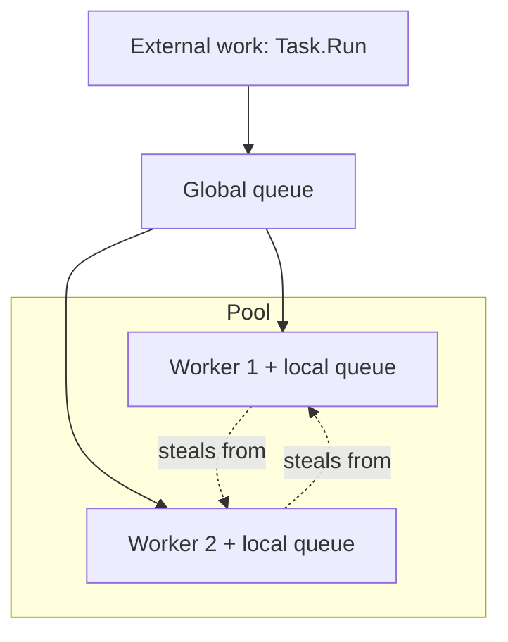

> [!summary]
> A **thread** is the unit the operating system schedules onto a CPU core. Each one is expensive: about 1 MB of stack and a real cost to create and to switch between. The **thread pool** is a shared set of reusable worker threads that the runtime hands out for short jobs, so you never pay to create a thread per task. Almost all concurrent work in .NET — `Task.Run`, async continuations, timer callbacks — runs on the pool, which is why understanding it explains both throughput and starvation.

## The Thread

Your code has to run on something. That something is a thread.

A thread is a single sequence of instructions that the CPU executes one after another. To run it, the operating system gives it three things: a **stack** (its own working memory for local variables and call frames), a set of **registers** (including the instruction pointer, which marks the next instruction), and a slot in the OS **scheduler**.

A machine has only a few CPU cores, but far more threads than cores. The OS scheduler solves this by **time-slicing**: it runs one thread on a core for a few milliseconds, saves its registers, loads another thread's registers, and runs that one. This save-and-load is a **context switch**. It happens preemptively, meaning the OS can pause a thread at any point, not just where the thread chooses.

In .NET a `Thread` object is a thin managed wrapper over one real OS thread. When you write `new Thread(...).Start()`, the runtime asks the OS to create an OS thread. So a managed thread is not cheaper than an OS thread. It is an OS thread.

## The Cost of a Thread

You cannot just make a thread per unit of work. Three costs get in the way.

- **Memory.** Each thread reserves a stack, 1 MB by default on Windows. A thousand threads reserve about a gigabyte of address space before running any of your code.
- **Creation.** Making a thread means a system call, a stack allocation, and kernel bookkeeping. That is slow relative to the tiny jobs you often want to run.
- **Context switches.** Every switch costs a kernel transition and, worse, throws away the CPU caches the old thread had warmed up. Past a point, adding threads makes things *slower*, because the cores spend their time switching instead of working.

So threads are a scarce, heavy resource. The thread pool exists to stop you from creating and destroying them for every small job.

## The Thread Pool

Most work items are short. A request handler, a `Task.Run` callback, an async continuation each run for a few microseconds to milliseconds. Creating a fresh thread for each one, then throwing it away, would spend more time on thread management than on the work.

The **thread pool** fixes this by reuse. The runtime keeps a set of long-lived worker threads. You hand it a work item, it runs that item on a free worker, and when the item finishes the worker goes back to the pool to take the next one. The threads are created once and reused for the life of the process.

You rarely talk to the pool directly. You use it through higher-level APIs that queue onto it:

```csharp
Task.Run(() => Work());                       // queues Work onto the pool
ThreadPool.QueueUserWorkItem(_ => Work());     // the low-level version
// async continuations queue here too, when there is no SynchronizationContext
```

The trade-off: because you do not own the thread, you must not treat it as yours. You must not block it for a long time, and you must not stash state on it and expect that state later. Both of those are covered in the pitfalls.

## Work Queues and Work-Stealing

The pool needs somewhere to hold work items that are waiting for a free thread. A single shared queue would work, but every thread would contend on one lock to take the next item. Under load that lock becomes the bottleneck.

So the pool uses two levels of queue:

- A **global queue** for work submitted from outside the pool (your top-level `Task.Run`).
- A **local queue per worker thread** for work a pool thread itself creates (a `Task` started from inside another pool task).

A worker takes from its own local queue first, with no shared lock, which is fast and keeps related work on the same warm cache. It takes from the local queue **LIFO** (newest first), because the newest task is the one whose data is most likely still in cache.

When a worker's local queue is empty, it does not sit idle. It **steals** a work item from another worker's local queue, taking from the far end (FIFO), so it grabs the oldest item and avoids fighting the owner over the newest one. This is **work-stealing**, and it keeps all cores busy without a single central lock.



## Thread Injection and Hill Climbing

How many worker threads should the pool have? Too few and work waits while cores sit idle. Too many and the machine drowns in context switches. The pool tunes this number itself, with two separate mechanisms.

The pool starts with a small number of threads, on the order of the CPU count. That floor is `ThreadPool.GetMinThreads` and you can raise it.

- **Starvation-avoidance injection.** If work is queued but the queue is not draining, the pool assumes its threads are stuck and adds one more. It does this slowly, at most about one new thread every 500 ms. This is a safety valve, not a fast-response mechanism.
- **Hill climbing.** In parallel, the pool watches its own throughput — how many work items complete per second. It nudges the thread count up or down and keeps the change if throughput improved, like climbing toward the peak of a hill. This finds a good steady-state count for the current load without a human tuning it.

The 500 ms figure matters in practice. It is why a burst of blocking work causes a latency spike: the pool cannot conjure threads instantly, it can only add them about twice a second.

## Where Async Continuations Run

This is the link back to [[Async and Await|async]]. When an `await` suspends on I/O, no thread waits. The OS signals completion, and the runtime queues the continuation — the rest of your method — as a work item onto the thread pool. A free worker picks it up and runs `MoveNext` again. (In a UI or legacy-ASP.NET app the continuation instead posts back to the captured `SynchronizationContext`; see [[Async and Await]].)

So the pool is the engine under async. "Async frees the thread" means the thread returns to this pool and runs other queued work. "Thread-pool starvation" means every pool worker is blocked, so those queued continuations have nothing to run them, and the whole system stalls. The two topics are the same machine seen from two sides.

## Pitfalls & Trade-offs

**1. Blocking a pool thread starves the pool.** The pool is sized for short work. Block its threads and it runs dry.

```csharp
// Runs on a pool thread. Blocking calls here hold a scarce worker hostage.
Task.Run(() =>
{
    var data = FetchAsync().Result;   // blocks this pool thread until the I/O completes
    Thread.Sleep(5000);               // holds it for another 5 seconds
});
```

Every worker doing this is one fewer worker for real work. Because the pool only adds threads about twice a second, a burst of blocking calls stalls everything queued behind them. Fix: never block on async inside pool work — `await` instead, so the thread is freed while the I/O runs.

**2. Long or blocking work does not belong on the pool.** Even without async, a task that runs for minutes, or that blocks on a file or a lock, ties up a pool thread the whole time. For genuinely long-running work, ask for a dedicated thread instead of borrowing a pool one:

```csharp
// A dedicated thread, created outside the pool, for long-lived work:
Task.Factory.StartNew(() => ConsumeQueueForever(),
    TaskCreationOptions.LongRunning);
```

This buys a thread you fully occupy at the cost of one extra OS thread, which is the right trade when the work never returns quickly.

**3. Creating a thread per work item wastes the pool's whole point.**

```csharp
foreach (var item in items)
    new Thread(() => Process(item)).Start();   // 10 000 items -> 10 000 OS threads
```

At scale this reserves gigabytes of stacks and drowns the CPU in context switches. Use `Task.Run(() => Process(item))` so the pool runs them on a bounded set of reused threads.

**4. The pool ramps up slowly, so bursts spike latency.** A service that is idle, then suddenly gets 200 concurrent CPU-bound tasks, has only its floor of threads at first. The rest queue while the pool adds threads at roughly one per 500 ms. If your load is genuinely this bursty, raise the floor:

```csharp
ThreadPool.SetMinThreads(workerThreads: 100, completionPortThreads: 100);
```

The cost: a high floor means more threads kept alive and more context switching at low load, so raise it only with evidence, not by default.

**5. Pool threads run concurrently, so shared state races.** Many work items run on many threads at once. Any mutable state they share is a [[Race Conditions|race]] waiting to happen, and needs a [[Synchronization Primitives|lock or other primitive]].

```csharp
int total = 0;
Parallel.ForEach(orders, o => total += o.Amount);   // lost updates: += is not atomic
```

**6. Do not assume thread affinity on the pool.** A pool thread is not yours and is not stable across an `await`. Code after an `await` may resume on a different pool thread, so anything stored in `[ThreadStatic]` state before the `await` may be gone after it.

```csharp
[ThreadStatic] static string _tenant;

_tenant = "acme";
await LoadAsync();
Use(_tenant);            // may be null: the continuation can resume on a different pool thread
```

Use `AsyncLocal<T>` instead. It flows with the logical call across `await`, not with the thread.

## In Production

A web API is fast in testing but times out in bursts. The cause is almost always a blocking call on a hot path, which turns the thread pool from an asset into the bottleneck.

```csharp
// The problem: a sync controller that blocks a pool thread per request.
[HttpGet("report")]
public IActionResult GetReport()
{
    var rows = _db.QueryAsync().Result;   // one pool thread blocked for the whole query
    return Ok(Render(rows));
}
```

Under 500 concurrent requests, the pool needs 500 blocked threads. It has its floor, then grows by only about one thread every 500 ms, so most requests sit in the queue. Latency climbs from milliseconds to seconds, and health checks start failing. This is thread-pool starvation.

```csharp
// The fix: go async, so the thread is freed during the query.
[HttpGet("report")]
public async Task<IActionResult> GetReport()
{
    var rows = await _db.QueryAsync();    // thread returns to the pool while the DB works
    return Ok(Render(rows));
}
```

Now a handful of pool threads serve all 500 requests, because each thread is only busy for the microseconds of actual CPU work, not the 20 ms of waiting. `ThreadPool.SetMinThreads` is sometimes used as a stopgap to survive bursts while the real blocking call is hunted down, but it treats the symptom. The cure is to stop blocking pool threads.

## Questions

> [!question]- Why is creating a thread per request a bad idea at scale?
> A thread is an OS resource, not a cheap object. Each reserves about 1 MB of stack and costs a system call to create. Thousands of them reserve gigabytes and force so many context switches that the cores spend their time switching instead of working. Throughput drops as you add threads past a point. The thread pool exists so you reuse a bounded set of threads instead of creating one per job.

> [!question]- What does the thread pool actually save you compared to `new Thread()`?
> The create-and-destroy cost. Pool threads are created once and reused for the life of the process, so a short work item pays no thread-creation cost. It also bounds the number of threads, so you do not blow past the point where context switching dominates. You give up ownership of the thread in exchange, so you must not block it or store per-thread state.

> [!question]- What are the two levels of queue in the pool, and why two?
> A global queue for work submitted from outside the pool, and a local queue per worker for work a pool thread creates itself. Two levels avoid a single shared lock: a worker takes from its own local queue with no contention (LIFO, for cache warmth), and only reaches for the shared/other queues when its own is empty. Idle workers steal from other locals (FIFO) to stay busy. This keeps all cores working without one central bottleneck.

> [!question]- The pool has "hill climbing" and "starvation-avoidance injection." What is the difference?
> Starvation-avoidance injection is a safety valve: if work is queued but not draining, the pool adds at most about one thread every 500 ms, assuming its threads are stuck. Hill climbing is an optimiser: it measures completed-work throughput, nudges the thread count up or down, and keeps changes that improve throughput, converging on a good steady-state count. One reacts to blockage slowly; the other tunes for performance continuously.

> [!question]- Why does one blocking `.Result` deep in a request handler take down a whole service under load?
> It holds a pool thread for the entire wait instead of the microseconds of real work. Under load every request does the same, so all pool threads end up blocked. New requests, and the async continuations that would complete the blocked ones, have no thread to run on. The pool adds threads only about twice a second, far slower than requests arrive, so the queue grows without bound and latency explodes. This is thread-pool starvation.

> [!question]- You store a value in `[ThreadStatic]` before an `await` and read it after. Safe?
> No. The continuation after the `await` can resume on a different pool thread, so the `[ThreadStatic]` value set on the first thread is not visible on the second. Thread-local state does not follow the logical flow of async code. Use `AsyncLocal<T>`, which flows across `await` with the `ExecutionContext`.

## Related

- [[Async and Await]]. Async continuations and I/O completions run on this pool; starvation is the pool running dry.
- [[Concurrency vs Parallelism]]. The pool gives you parallelism across cores; async gives you concurrency without threads.
- [[Synchronization Primitives]]. `lock`, `SemaphoreSlim`, `Interlocked` for the shared state pool threads touch.
- [[Race Conditions]] and [[Deadlocks]]. The hazards of many pool threads running at once.

## References

- [Managed threading (.NET)](https://learn.microsoft.com/en-us/dotnet/standard/threading/). Threads, the scheduler, and the `Thread` type.
- [The managed thread pool (.NET)](https://learn.microsoft.com/en-us/dotnet/standard/threading/the-managed-thread-pool). Queuing work, min/max threads, and pool behaviour.
- [Debug thread pool starvation (.NET)](https://learn.microsoft.com/en-us/dotnet/core/diagnostics/debug-threadpool-starvation). The starvation symptom, the ~500 ms injection, and diagnosis.
- [The CLR thread pool thread injection algorithm](https://mattwarren.org/2017/04/13/The-CLR-Thread-Pool-Thread-Injection-Algorithm/). Hill climbing and injection in depth.
