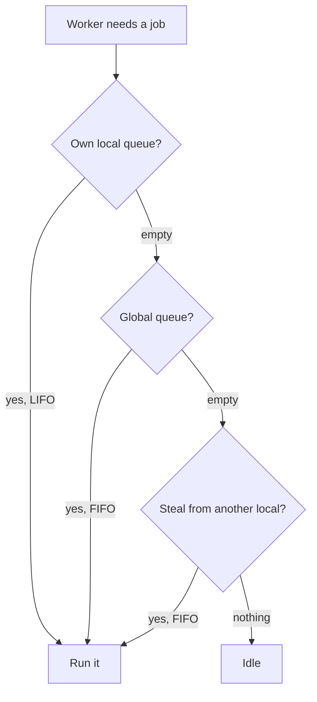

> [!summary]
> A **thread** is what the OS runs on a CPU core. Threads are expensive: about 1 MB of stack each, a cost to create one, and a cost every time the OS swaps one on or off a core. The **thread pool** keeps a set of threads alive and reuses them for short jobs, so you never create a thread per task. Nearly all concurrent work in .NET runs on it — `Task.Run`, async continuations, timers — so it drives both throughput and starvation.

## The Thread

A thread is one sequence of instructions that a CPU core runs, one after another. The OS gives each thread a **stack** (memory for its local variables and calls), a set of **registers** (including the pointer to the next instruction), and a place in the **scheduler**.

There are always more threads than cores, so the scheduler runs each thread for a few milliseconds, then swaps in the next one. That swap is a **context switch**, and its cost drives most of this note.

## Cores, Hardware Threads, and OS Threads

Three things are all called "threads", and they count differently. Your CPU might be "6 cores, 12 threads", while the debugger shows 26 threads in your process. Both numbers are right.

- **Cores** are the physical units that run code. Six of them.
- **Hardware threads** are how many threads run *at the same instant*. Each core runs two threads at once (a feature called hyper-threading, or SMT), so this CPU runs 12 threads at the same instant. That is the hard ceiling on parallelism.
- **OS threads** are the threads that *exist* and get scheduled. There can be far more than 12. At any instant only 12 threads are running; the rest are **blocked** (waiting on I/O, a lock, or `Sleep`) or **ready** and waiting their turn. The OS rotates them across the 12 hardware threads.

So 26 OS threads on this machine is normal. Most of them are asleep, and you created few of them — the runtime made the rest: thread-pool workers, I/O threads, GC threads, the finalizer thread, timer threads.

The rule: hardware threads are how many threads run at once; OS threads are how many threads exist. For the rest of this note, "thread" means an OS thread.

## Managed Threads vs OS Threads

`new Thread(...).Start()` makes .NET ask the OS for a **real OS thread**, the same kind any program gets, and the OS runs it. A managed thread is not a lighter thing. It *is* an OS thread, and creating one costs what an OS thread costs.

So why the separate `Thread` class? Because .NET has to track the threads running your code, for three jobs:

- **Garbage collection.** The GC moves objects around in memory. Before it can, it freezes every thread running your code and reads each thread's stack to find which objects are still used. It can only freeze a thread at a **safe point** — a spot where .NET knows what the stack holds. So .NET must know each thread and be able to stop it. It cannot do this with a thread it did not create.
- **An id.** Each thread gets a `ManagedThreadId`, which is .NET's own number for it, not the OS thread's id.
- **Foreground or background.** A **foreground** thread keeps the program running: the program exits only after the last foreground thread finishes. A **background** thread does not. `new Thread(...)` gives you a foreground thread; every pool thread is a background thread.

```csharp
var t = new Thread(Work);
t.IsBackground = true;   // now it will not keep the program alive on its own
t.Start();
```

## The Cost of a Thread

You cannot create a thread per job. Two costs stop you here; the third, context switching, is the next section.

- **Memory.** Each thread reserves a 1 MB stack (the Windows default). A thousand threads is a gigabyte, reserved before your code runs.
- **Creation.** Creating a thread is a system call: the OS sets up the stack, its own bookkeeping, and a scheduler slot. That is slow next to a job that runs for microseconds.

## Context Switching

A core runs one thread at a time, but there are more runnable threads than cores, so the OS keeps swapping threads on and off the cores. Each swap is a **context switch**, and it caps how many threads are useful.

A switch happens when a thread **blocks** — waits on I/O, a lock, or `Sleep` — and gives up the core, or when the OS **preempts** a thread after its time slice runs out (tens of milliseconds).

Either way, the kernel saves the running thread's registers and instruction pointer, picks the next thread, and loads its saved state so the core resumes it where it stopped. That save-and-restore is cheap, a couple of microseconds.

The expensive part is the cache. A CPU keeps a small, fast on-chip memory called the **cache**, holding the data it is using, so it does not reach out to slow RAM every time. A running thread fills the cache with its own data. The next thread overwrites it. When the first thread comes back, its data is gone from the cache, so it stalls fetching it from RAM again. For memory-heavy work this stalling costs far more than the switch itself.

This is why more threads do not mean more work. Once the runnable threads outnumber the hardware threads, the cores spend a growing share of their time switching and refilling caches instead of running your code.

## The Thread Pool

Most jobs are short. A request handler, a `Task.Run` callback, or an async continuation each run for microseconds to a few milliseconds. Creating a thread for each one and destroying it after would cost more than the job itself.

The pool reuses threads instead. It keeps a set of worker threads alive, runs your job on a free worker, and returns that worker to the pool when the job finishes. The threads live for the whole process.

You reach the pool through the APIs that queue onto it:

```csharp
Task.Run(() => Work());                     // queues Work onto the pool
ThreadPool.QueueUserWorkItem(_ => Work());  // the low-level version
```

Because the worker is not yours, two rules follow: do not block it for long, and do not store state on it and expect that state later. Both are in the pitfalls.

## Work Queues and Work-Stealing

The pool holds waiting jobs in queues. One shared queue would make every worker fight over a single lock, so the pool keeps two kinds: a **global queue**, and a **local queue per worker**. Work you submit from outside the pool (a top-level `Task.Run`) goes on the global queue. Work a pool thread creates itself (a `Task` started inside another pool job) goes on that worker's local queue.

A worker looks for its next job in a fixed order:

1. **Its own local queue**, newest first (LIFO). No lock, and the newest job's data is the most likely to still be in cache.
2. **The global queue**, oldest first (FIFO), if its local queue is empty.
3. **Steal** from another worker's local queue, from the oldest end, only if the global queue is also empty.

Stealing is the last step, not the step right after an empty local queue. Jumping straight from "local queue empty" to "steal" is the common mistake.



## Thread Injection and Hill Climbing

How many workers should the pool run? Too few and jobs wait; too many and the machine drowns in context switches. The pool tunes the count itself.

It keeps two kinds of thread: **worker threads** for queued jobs, and **I/O threads** for async I/O completions. `ThreadPool.SetMinThreads(workerThreads, completionPortThreads)` sets a floor for each. The pool starts near the CPU count and grows the worker count with two mechanisms:

- **Starvation injection.** If jobs are queued but not draining, the pool assumes its threads are stuck and adds one — at most about one every 500 ms. It is a slow safety valve.
- **Hill climbing.** The pool measures completed jobs per second, nudges the worker count up or down, and keeps the change if throughput rose.

The 500 ms rate is why a burst of blocking work spikes latency: the pool cannot add threads fast. (Since .NET 6 it detects some blocking calls and ramps faster, but do not rely on it.)

## Where Async Continuations Run

This connects to [[Async and Await|async]]. When an `await` suspends on I/O, no thread waits. The OS signals completion, and the runtime queues the continuation — the rest of your method — onto the pool, where a free worker runs it. (In a UI or old-ASP.NET app it goes back to the captured `SynchronizationContext` instead, unless you used `ConfigureAwait(false)`.)

So the pool is the engine under async. "Async frees the thread" means the worker goes back to the pool. "Starvation" means every worker is blocked, so those queued continuations have nothing to run them.

## Pitfalls & Trade-offs

**1. Blocking a pool thread starves the pool.**

```csharp
Task.Run(() =>
{
    var data = FetchAsync().Result;   // blocks this worker until the I/O finishes
    Thread.Sleep(5000);               // holds it for 5 more seconds
});
```

Each blocked worker is one fewer worker for real work, and the pool adds threads only about twice a second, so a burst of these stalls everything queued behind them. Fix: `await` instead of blocking, so the worker is freed while the I/O runs.

**2. Long or blocking work does not belong on the pool.** A job that runs for minutes, or blocks on a lock or a file, holds a worker the whole time. Give it a dedicated thread instead:

```csharp
Task.Factory.StartNew(() => ConsumeQueueForever(), TaskCreationOptions.LongRunning);
```

That costs one extra OS thread, which is the right trade when the work never returns quickly.

**3. A thread per job wastes the pool.**

```csharp
foreach (var item in items)
    new Thread(() => Process(item)).Start();   // 10 000 items, 10 000 OS threads
```

That reserves gigabytes of stacks and buries the cores in context switches. Use `Task.Run(() => Process(item))` so the pool runs them on a bounded set of reused threads.

**4. The pool ramps up slowly, so bursts spike latency.** A service that is idle, then gets 200 CPU-bound jobs at once, has only its floor of threads at first. The rest queue while the pool adds about one thread every 500 ms. If the load is really this bursty, raise the floor:

```csharp
ThreadPool.SetMinThreads(workerThreads: 100, completionPortThreads: 100);
```

The cost is more threads alive and more switching at low load, so raise it with evidence, not by default.

**5. Pool threads run at once, so shared state races.** Many jobs run on many threads at the same time. Any mutable state they share is a [[Race Conditions|race]] and needs a [[Synchronization Primitives|lock]].

```csharp
int total = 0;
Parallel.ForEach(orders, o => total += o.Amount);   // += is not atomic: lost updates
```

**6. A pool thread is not stable across an `await`.** The code after an `await` may run on a different worker, so a `[ThreadStatic]` value set before the `await` can be gone after it.

```csharp
[ThreadStatic] static string _tenant;
_tenant = "acme";
await LoadAsync();
Use(_tenant);   // may be null: a different worker resumed here
```

Use `AsyncLocal<T>` instead. It follows the async call across `await`, not the thread.

## In Production

A web API is fast in tests but times out under bursts. The usual cause is a blocking call on a hot path that turns the pool into the bottleneck.

```csharp
[HttpGet("report")]
public IActionResult GetReport()
{
    var rows = _db.QueryAsync().Result;   // one worker blocked for the whole query
    return Ok(Render(rows));
}
```

At 500 concurrent requests, the pool needs 500 blocked workers. It has its floor, then adds about one thread every 500 ms, so most requests sit in the queue. Latency climbs from milliseconds to seconds and health checks fail. That is thread-pool starvation.

```csharp
[HttpGet("report")]
public async Task<IActionResult> GetReport()
{
    var rows = await _db.QueryAsync();   // the worker returns to the pool during the query
    return Ok(Render(rows));
}
```

Now a few workers serve all 500 requests, because each worker is busy only for the microseconds of real work, not the 20 ms of waiting. `SetMinThreads` can prop a service up through bursts, but it treats the symptom. The fix is to stop blocking workers.

## Questions

> [!question]- Is a managed thread the same as an OS thread? What does .NET add?
> Yes. `new Thread()` creates a real OS thread, so it is not cheaper. .NET tracks it in its `Thread` class for three jobs: the GC must freeze every thread and read its stack for live objects, so it has to know each thread and be able to stop it; each thread gets a `ManagedThreadId`, .NET's own number and not the OS id; and each is foreground or background, which decides whether it keeps the program alive.

> [!question]- What happens in a context switch, and where is the real cost?
> The kernel saves the running thread's registers and instruction pointer, picks the next thread, and loads its state so the core resumes it. That save-and-restore is cheap, a couple of microseconds. The real cost is the cache: the next thread overwrites the old thread's cached data, so when the old thread comes back it stalls fetching from RAM again. For memory-heavy work this costs far more than the switch, which is why threads past the hardware-thread count lower throughput.

> [!question]- A pool worker's local queue is empty. Where does it look next?
> The global queue, not another worker's queue. The order is: own local queue (LIFO), then the global queue (FIFO), then steal from another worker's local queue (FIFO), with stealing last. Going straight from an empty local queue to stealing is the common mistake.

> [!question]- Why does one blocking `.Result` on a hot path take down a service under load?
> It holds a worker for the whole wait instead of the microseconds of real work. Under load every request does the same, so all workers block. New requests, and the continuations that would free the blocked workers, have no worker to run on, and the pool adds threads only about twice a second. The queue grows without bound and latency explodes. That is thread-pool starvation.

> [!question]- Thread injection vs hill climbing — what is the difference?
> Injection is a safety valve: if jobs are queued but not draining, the pool adds about one thread every 500 ms. Hill climbing is an optimiser: it measures completed jobs per second and moves the worker count toward whatever completes the most. One reacts to blockage slowly; the other tunes for throughput continuously.

> [!question]- You set a `[ThreadStatic]` value before an `await` and read it after. Safe?
> No. The continuation can resume on a different worker, so the value set on the first thread is not there on the second. Thread-local state does not follow the async flow. Use `AsyncLocal<T>`, which does.

## Related

- [[Async and Await]]. Async continuations and I/O completions run on this pool; starvation is the pool running dry.
- [[Concurrency vs Parallelism]]. The pool gives parallelism across cores; async gives concurrency without threads.
- [[Synchronization Primitives]]. `lock`, `SemaphoreSlim`, `Interlocked` for the shared state pool threads touch.
- [[Race Conditions]] and [[Deadlocks]]. The hazards of many pool threads running at once.

## References

- [Managed and unmanaged threading in Windows (.NET)](https://learn.microsoft.com/en-us/dotnet/standard/threading/managed-and-unmanaged-threading-in-windows). The managed-to-OS-thread relationship and `ManagedThreadId`.
- [Foreground and background threads (.NET)](https://learn.microsoft.com/en-us/dotnet/standard/threading/foreground-and-background-threads). Which threads keep the process alive.
- [The managed thread pool (.NET)](https://learn.microsoft.com/en-us/dotnet/standard/threading/the-managed-thread-pool). Queuing work, worker vs completion-port threads, min/max.
- [Debug thread pool starvation (.NET)](https://learn.microsoft.com/en-us/dotnet/core/diagnostics/debug-threadpool-starvation). The starvation symptom and the ~500 ms injection.
- [.NET ThreadPool starvation, and how queuing makes it worse (Criteo)](https://medium.com/criteo-engineering/net-threadpool-starvation-and-how-queuing-makes-it-worse-512c8d570527). The local/global queues and the work-stealing order.
