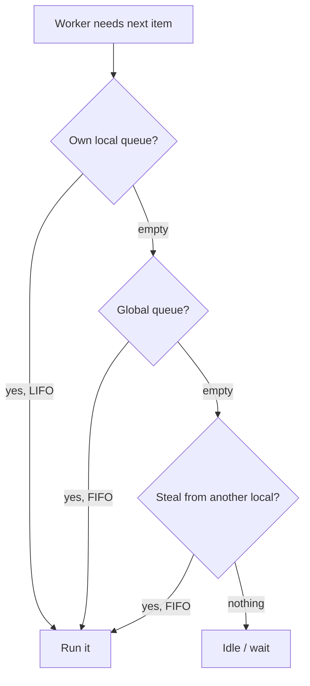

> [!summary]
> A **thread** is the unit the operating system schedules onto a CPU core. Each one is expensive: about 1 MB of stack, a real cost to create, and a context-switch cost every time the OS swaps it on or off a core. The **thread pool** is a shared set of reusable worker threads that the runtime hands out for short jobs, so you never pay to create a thread per task. Almost all concurrent work in .NET — `Task.Run`, async continuations, timer callbacks — runs on the pool, which is why understanding it explains both throughput and starvation.

## The Thread

Your code has to run on something. That something is a thread.

A thread is a single sequence of instructions that a CPU core executes one after another. To run it, the operating system gives it three things: a **stack** (its own memory for local variables and call frames), a set of **registers** (including the instruction pointer, which marks the next instruction to run), and an entry in the OS **scheduler**.

A machine has only a few cores but far more threads than cores. The scheduler shares the cores between them by running one thread for a short slice of time, then swapping in another. That swap is a context switch, and it has its own section below because its cost drives almost everything else here.

## Cores, Hardware Threads, and OS Threads

Three different things all get called "threads", and mixing them up causes real confusion. Say your CPU is "6 cores, 12 threads", but the debugger shows 26 threads in your process. Both numbers are right, because they count different things.

- **Cores** are the physical execution units. Six of them.
- **Hardware threads** are how many threads the CPU can run *at the very same instant*. Each core here runs two, a feature called hyper-threading (SMT), so the chip can run 12 threads at the same instant. (The two threads sharing a core also share its execution units, so 12 is not double the work of 6.) This is your ceiling on real parallelism. Nothing runs a thirteenth thread at that instant.
- **OS threads** are the threads that *exist* and get scheduled. There can be far more of them than hardware threads. At any instant at most 12 are actually running; the rest are **blocked** (waiting on I/O, a lock, or `Sleep`) or **ready** and waiting their turn. The OS rotates them across the 12 hardware threads by time-slicing.

So 26 OS threads on a 12-hardware-thread machine is normal. Most of them are asleep almost all the time, and you did not create most of them — the runtime did: several thread-pool workers (some idle), I/O completion threads, the GC threads, the finalizer thread, a timer thread, plus threads the debugger and your libraries start.

The rule: **hardware threads are how many run at the same instant; OS threads are how many exist and get juggled.** The rest of this note says "thread" to mean an OS thread — the kind you create and the kind the scheduler juggles.

## Managed Threads vs OS Threads

You create threads with the `Thread` class, but .NET does not run threads itself. The OS does. So what is a "managed thread"?

When you call `new Thread(...).Start()`, .NET asks the OS to create a **real OS thread** — the same kind any program gets — and the OS scheduler runs it. So a managed thread is **not** a cheaper, lighter thing. It is an OS thread. Creating one costs what creating an OS thread costs.

Then why does .NET give you its own `Thread` class instead of the OS thread directly? Because .NET has to keep track of every thread running your code, for three concrete jobs.

- **Garbage collection.** The .NET garbage collector moves objects around in memory as it cleans up. Before it can, it has to freeze every thread running your code and look through each thread's stack to see which objects are still in use. It can only freeze a thread at a **safe point** — a spot in the code where .NET knows exactly what is on the stack. To do that, .NET must know about every thread it started and be able to stop it on demand. It could not do this with a thread it never created. This is the main reason managed threads exist.
- **A thread id.** .NET gives each thread its own number, `ManagedThreadId`. It is not the OS thread's id — .NET keeps its own count.
- **Foreground or background.** .NET decides whether your program may exit while a thread is still running. A **foreground** thread keeps the program alive: it stays open until the last foreground thread finishes. A **background** thread does not — once the foreground threads are done, .NET shuts the program down and drops any background threads still running. `new Thread(...)` gives you a foreground thread. Every thread-pool thread is a background thread.

```csharp
var t = new Thread(Work);       // foreground by default: keeps the program alive
t.IsBackground = true;          // now it will not hold the program open on its own
t.Start();
Console.WriteLine(t.ManagedThreadId);   // .NET's own id, not the OS thread id
```

In short: a managed thread is a real OS thread that .NET tracks, so it can freeze it for garbage collection, give it an id, and decide whether it keeps the program alive.

## The Cost of a Thread

You cannot make a thread per unit of work. Two costs get in the way here, and a third (context switching) gets its own section next.

- **Memory.** Each thread gets its own stack, 1 MB by default on Windows. A thousand threads is about a gigabyte, reserved before your code does anything.
- **Creation.** Making a thread is a system call: the OS sets up the stack, its own bookkeeping, and a scheduler entry. That is slow next to the microsecond-scale jobs you often want to run.

Because both costs are real, you reuse threads instead of creating one per job. That is what the thread pool is for.

## Context Switching

A core runs one thread at a time, but there are always more runnable threads than cores. Sharing the cores means repeatedly swapping threads on and off them. That swap is a **context switch**, and it is the cost that caps how many threads are useful.

A switch happens for one of two reasons:

- **Voluntary.** The thread blocks — it waits on I/O, a lock, or `Thread.Sleep` — and gives up the core because it has nothing to do.
- **Involuntary (preemption).** The OS interrupts a thread whose time slice has expired (on the order of tens of milliseconds) so another thread gets a turn.

The mechanism is the same either way. The kernel saves the running thread's CPU state — the general registers, the instruction pointer (where it was in the code), and the stack pointer — into that thread's kernel structure. This runs in kernel mode. The scheduler then picks the next ready thread, loads its saved state back into the registers, and the core resumes it exactly where it had stopped.

The **direct** cost of that save-and-restore is small: a couple of microseconds at most.

The **indirect** cost is the one that hurts, and it comes down to one idea. A CPU keeps a small, very fast on-chip memory called the **cache**, where it holds the data it is actively using so it does not have to reach out to slow main memory (RAM) every time. While a thread runs, it fills the cache with its own data. When the OS switches in another thread, that thread overwrites the cache with *its* data. So when the first thread comes back, its data is gone from the cache, and it has to fetch from RAM again, which is much slower. It stalls while waiting. For memory-heavy work this refilling can cost far more than the switch itself.

This is the real reason more threads do not mean more throughput. Once the number of running threads passes the number of hardware threads, the cores spend a growing share of their time switching and refilling caches instead of doing work.

## The Thread Pool

Most work items are short. A request handler, a `Task.Run` callback, or an async continuation each run for microseconds to a few milliseconds. Creating a fresh thread for each one and destroying it after would spend more time managing threads than doing the work, and would pay the creation and context-switch costs above for nothing.

The **thread pool** solves this with reuse. The runtime keeps a set of long-lived worker threads. You hand it a work item, it runs that item on a free worker, and when the item finishes the worker goes back to the pool for the next one. The threads are created once and live for the process.

You rarely talk to the pool directly. You use it through APIs that queue onto it:

```csharp
Task.Run(() => Work());                        // queues Work onto the pool
ThreadPool.QueueUserWorkItem(_ => Work());      // the low-level version
// async continuations queue here too, when there is no SynchronizationContext
```

The trade-off: you do not own the thread. So you must not block it for long, and you must not store state on it and expect that state to still be there later. Both are in the pitfalls.

## Work Queues and Work-Stealing

The pool needs somewhere to hold work items waiting for a free thread. A single shared queue would work, but every worker would contend on one lock to take the next item, and under load that lock becomes the bottleneck.

So the pool keeps two kinds of queue: one **global queue**, and a **local queue per worker thread**. Work submitted from outside the pool (your top-level `Task.Run`) goes on the global queue. Work a pool thread creates itself (a `Task` started from inside another pool task) goes on that worker's own local queue.

When a worker looks for its next item, it checks in a **fixed order**:

1. **Its own local queue, newest-first (LIFO).** No shared lock, and the newest task's data is the most likely to still be warm in cache.
2. **If the local queue is empty, the global queue, oldest-first (FIFO).** This is where externally submitted work lives.
3. **Only if the global queue is also empty does it steal** from another worker's local queue, taking from the far (oldest) end (FIFO) to avoid fighting the owner, which takes from the near (newest) end.

Work-stealing is the **last** step, not the step right after the local queue. A worker reaches into another's queue only when both its own local queue and the global queue are empty. Getting this order wrong — jumping straight from an empty local queue to stealing — is a common misconception.



## Thread Injection and Hill Climbing

How many worker threads should the pool have? Too few and work waits while cores sit idle. Too many and the machine drowns in context switches. The pool tunes the number itself.

The pool actually keeps **two kinds of thread**: **worker threads** for queued work, and **I/O completion threads** for async I/O completions. `ThreadPool.GetMinThreads` / `SetMinThreads` and their `Max` counterparts control both, each with a `(workerThreads, completionPortThreads)` pair. (The `completionPortThreads` name is Windows heritage; the API exists on every platform, even though the async-I/O engine differs off Windows.) The pool starts near a floor on the order of the CPU count, and grows and shrinks the worker count from there with two separate mechanisms:

- **Starvation-avoidance injection.** If work is queued but the queue is not draining, the pool assumes its threads are stuck and adds one more. It does this slowly, at most about one new thread every 500 ms. It is a safety valve, not a fast response.
- **Hill climbing.** In parallel, the pool measures its own throughput — completed work items per second. It nudges the thread count up or down and keeps the change if throughput improved, climbing toward the peak. This finds a good steady-state count for the current load with no human tuning.

The 500 ms figure matters in practice. It is why a burst of blocking work causes a latency spike: the pool cannot conjure threads instantly, only about two per second. Modern .NET (since .NET 6) detects some blocking `Task` calls and ramps the worker count up faster than this, so real starvation episodes can be briefer than the 500 ms math implies. Do not rely on it — the cure is still to stop blocking pool threads.

## Where Async Continuations Run

This is the link back to [[Async and Await|async]]. When an `await` suspends on I/O, no thread waits. The OS signals completion, and the runtime queues the continuation — the rest of your method — as a work item onto the thread pool. A free worker picks it up and runs `MoveNext` again. (In a UI or legacy-ASP.NET app the continuation instead posts back to the captured `SynchronizationContext`, unless the code used `ConfigureAwait(false)` to opt out and stay on the pool; see [[Async and Await]].)

So the pool is the engine under async. "Async frees the thread" means the thread returns to this pool and runs other queued work. "Thread-pool starvation" means every pool worker is blocked, so the queued continuations have nothing to run them and the whole system stalls. The two topics are the same machine seen from two sides.

## Pitfalls & Trade-offs

**1. Blocking a pool thread starves the pool.** The pool is sized for short work. Block its threads and it runs dry.

```csharp
// Runs on a pool thread. Blocking here holds a scarce worker hostage.
Task.Run(() =>
{
    var data = FetchAsync().Result;   // blocks this pool thread until the I/O completes
    Thread.Sleep(5000);               // holds it for another 5 seconds
});
```

Every worker doing this is one fewer worker for real work. Because the pool adds threads only about twice a second, a burst of blocking calls stalls everything queued behind them. Fix: never block on async inside pool work — `await` instead, so the thread is freed while the I/O runs.

**2. Long or blocking work does not belong on the pool.** Even without async, a task that runs for minutes, or blocks on a file or a lock, ties up a pool thread the whole time. For genuinely long-running work, ask for a dedicated thread instead of borrowing a pool one:

```csharp
// A dedicated thread, created outside the pool, for long-lived work:
Task.Factory.StartNew(() => ConsumeQueueForever(),
    TaskCreationOptions.LongRunning);
```

This buys a thread you fully occupy at the cost of one extra OS thread, which is the right trade when the work never returns quickly.

**3. Creating a thread per work item wastes the pool's whole point.**

```csharp
foreach (var item in items)
    new Thread(() => Process(item)).Start();   // 10 000 items -> 10 000 OS threads
```

At scale this reserves gigabytes of stacks and drowns the cores in context switches. Use `Task.Run(() => Process(item))` so the pool runs them on a bounded set of reused threads.

**4. The pool ramps up slowly, so bursts spike latency.** A service that is idle, then suddenly gets 200 concurrent CPU-bound tasks, has only its floor of threads at first. The rest queue while the pool adds threads at roughly one per 500 ms. If your load is genuinely this bursty, raise the floor:

```csharp
ThreadPool.SetMinThreads(workerThreads: 100, completionPortThreads: 100);
```

The cost: a high floor keeps more threads alive and adds context switching at low load, so raise it only with evidence, not by default.

**5. Pool threads run concurrently, so shared state races.** Many work items run on many threads at once. Any mutable state they share is a [[Race Conditions|race]] waiting to happen and needs a [[Synchronization Primitives|lock or other primitive]].

```csharp
int total = 0;
Parallel.ForEach(orders, o => total += o.Amount);   // lost updates: += is not atomic
```

**6. Do not assume thread affinity on the pool.** A pool thread is not yours and is not stable across an `await`. Code after an `await` may resume on a different pool thread, so anything stored in `[ThreadStatic]` state before the `await` may be gone after it.

```csharp
[ThreadStatic] static string _tenant;

_tenant = "acme";
await LoadAsync();
Use(_tenant);            // may be null: the continuation can resume on a different pool thread
```

Use `AsyncLocal<T>` instead. It flows with the logical call across `await`, not with the thread.

## In Production

A web API is fast in testing but times out in bursts. The cause is almost always a blocking call on a hot path, which turns the thread pool from an asset into the bottleneck.

```csharp
// The problem: a sync controller that blocks a pool thread per request.
[HttpGet("report")]
public IActionResult GetReport()
{
    var rows = _db.QueryAsync().Result;   // one pool thread blocked for the whole query
    return Ok(Render(rows));
}
```

Under 500 concurrent requests, the pool needs 500 blocked threads. It has its floor, then grows by only about one thread every 500 ms, so most requests sit in the queue. Latency climbs from milliseconds to seconds, and health checks start failing. This is thread-pool starvation.

```csharp
// The fix: go async, so the thread is freed during the query.
[HttpGet("report")]
public async Task<IActionResult> GetReport()
{
    var rows = await _db.QueryAsync();    // thread returns to the pool while the DB works
    return Ok(Render(rows));
}
```

Now a handful of pool threads serve all 500 requests, because each thread is busy only for the microseconds of actual CPU work, not the 20 ms of waiting. `ThreadPool.SetMinThreads` is sometimes raised as a stopgap to survive bursts while the real blocking call is hunted down, but it treats the symptom. The cure is to stop blocking pool threads.

## Questions

> [!question]- Is a managed `Thread` the same as an OS thread? What does the CLR add?
> No, it is not something lighter. `new Thread(...)` makes .NET ask the OS for a real OS thread, and the OS schedules it, so it costs what an OS thread costs. .NET keeps it in its own `Thread` class to do three concrete jobs: the GC has to freeze every thread and read its stack to find live objects, and it can only do that with threads it created and can stop at a safe point; each thread gets a `ManagedThreadId`, its own number and not the OS id; and each is foreground or background, which decides whether it keeps the program alive.

> [!question]- What actually happens during a context switch, and where does the real cost come from?
> The kernel saves the running thread's registers, instruction pointer, and stack pointer into its thread structure (in kernel mode), the scheduler picks the next ready thread, and its saved state is loaded back so the core resumes it where it stopped. The direct save/restore is cheap, a couple of microseconds at most. The real cost is indirect: the switched-in thread overwrites the CPU cache with its own data, so when the first thread resumes, its data is gone from the cache and it stalls fetching it from RAM again. For memory-heavy work that refilling costs far more than the switch itself, which is why adding threads past the hardware-thread count lowers throughput.

> [!question]- A pool worker's local queue is empty. Where does it look next?
> The global queue, not another worker's queue. The order is: own local queue newest-first (LIFO), then the global queue oldest-first (FIFO), and only if the global queue is also empty does it steal from another worker's local queue (FIFO, from the far end). Work-stealing is the last resort, after the global queue — jumping from an empty local queue straight to stealing is the common misconception.

> [!question]- Why is `new Thread()` per request a bad idea at scale?
> A thread is an OS resource, not a cheap object. Each reserves about 1 MB of stack and costs a system call to create. Thousands of them reserve gigabytes and force so many context switches that the cores spend their time switching and refilling caches instead of working. Throughput drops as you add threads past the core count. The pool exists so you reuse a bounded set of threads instead of creating one per job.

> [!question]- The pool has "hill climbing" and "starvation-avoidance injection." What is the difference?
> Starvation-avoidance injection is a safety valve: if work is queued but not draining, the pool adds at most about one thread every 500 ms, assuming its threads are stuck. Hill climbing is an optimiser: it measures completed-work throughput, nudges the thread count up or down, and keeps changes that improve throughput, converging on a good steady-state count. One reacts to blockage slowly; the other tunes for performance continuously.

> [!question]- Why does one blocking `.Result` deep in a request handler take down a whole service under load?
> It holds a pool thread for the entire wait instead of the microseconds of real work. Under load every request does the same, so all pool threads end up blocked. New requests, and the async continuations that would complete the blocked ones, have no thread to run on. The pool adds threads only about twice a second, far slower than requests arrive, so the queue grows without bound and latency explodes. This is thread-pool starvation.

> [!question]- You store a value in `[ThreadStatic]` before an `await` and read it after. Safe?
> No. The continuation after the `await` can resume on a different pool thread, so the `[ThreadStatic]` value set on the first thread is not visible on the second. Thread-local state does not follow the logical flow of async code. Use `AsyncLocal<T>` instead — it is built to follow the async call across `await`, not to stick to one thread.

## Related

- [[Async and Await]]. Async continuations and I/O completions run on this pool; starvation is the pool running dry.
- [[Concurrency vs Parallelism]]. The pool gives parallelism across cores; async gives concurrency without threads.
- [[Synchronization Primitives]]. `lock`, `SemaphoreSlim`, `Interlocked` for the shared state pool threads touch.
- [[Race Conditions]] and [[Deadlocks]]. The hazards of many pool threads running at once.

## References

- [Managed and unmanaged threading in Windows (.NET)](https://learn.microsoft.com/en-us/dotnet/standard/threading/managed-and-unmanaged-threading-in-windows). The managed-to-OS-thread relationship and `ManagedThreadId`.
- [Foreground and background threads (.NET)](https://learn.microsoft.com/en-us/dotnet/standard/threading/foreground-and-background-threads). Which threads keep the process alive.
- [Thread suspension, GC, and safe points (.NET)](https://learn.microsoft.com/en-us/dotnet/standard/threading/). Why the runtime must be able to suspend managed threads for collection.
- [The managed thread pool (.NET)](https://learn.microsoft.com/en-us/dotnet/standard/threading/the-managed-thread-pool). Queuing work, worker vs completion-port threads, min/max.
- [Debug thread pool starvation (.NET)](https://learn.microsoft.com/en-us/dotnet/core/diagnostics/debug-threadpool-starvation). The starvation symptom and the ~500 ms injection.
- [.NET ThreadPool starvation, and how queuing makes it worse (Criteo)](https://medium.com/criteo-engineering/net-threadpool-starvation-and-how-queuing-makes-it-worse-512c8d570527). Local/global queues and the work-stealing order.
