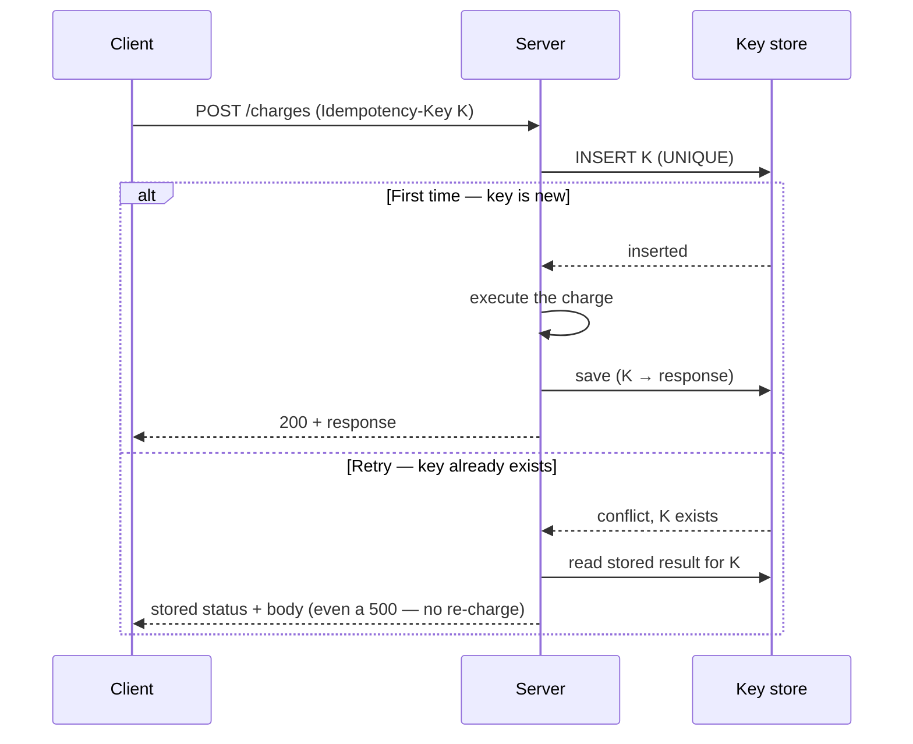

> [!summary]
> An operation is **idempotent** if performing it many times has the same effect as performing it once. It matters because in an unreliable network a caller often can't tell whether a request truly failed or just lost its response on the way back — and the only safe reaction to that uncertainty is to _retry_, which is only safe when the operation is idempotent.

In any distributed system a caller can never be sure whether a request that timed out actually _failed_ or merely _lost its response on the way back_. The safe reaction to that uncertainty is to **retry** — but a blind retry of a non-idempotent operation ("charge the card") causes double charges, duplicate orders, and corrupted state. Idempotency is what turns "retry" from a dangerous act into a safe default; it is the quiet foundation under payment APIs, message queues (at-least-once delivery), and every resilient service. There are two ways an operation gets there.

### Naturally idempotent operations

Some operations are idempotent by their very definition — doing them once equals doing them N times:

- `PUT /users/42 {name: "Ann"}` — _setting_ a value to `X` twice leaves it `X`.
- `DELETE /users/42` — deleting an already-deleted resource still leaves it gone.
- HTTP semantics classify `GET`, `PUT`, and `DELETE` as idempotent; `POST` — which _creates_ a new resource each time — is not. (RFC 9110 §9.2.2.)

This is distinct from a **safe** method: `GET`/`HEAD` are _read-only_ — no side effects the client asked for (a server may still log or count) — whereas an idempotent `DELETE` _does_ have a side effect, just a repeatable one. Every safe method is idempotent; not every idempotent method is safe.

### Made idempotent with an idempotency key

Operations that aren't naturally safe (`POST /charges`) are made retry-safe with a client-generated **idempotency key**: a unique token sent with the request and kept the _same_ across every retry of that one logical operation.

```http
POST /charges
Idempotency-Key: 3a1c9f4e-...      # identical on every retry of THIS charge
{ "amount": 5000, "currency": "usd" }
```



1. **First time:** the server executes the operation and stores `(key → response)`.
2. **Retry:** it finds the key and returns the _stored_ response without re-executing.

The **uniqueness constraint** on the key (typically a `UNIQUE` index) is what makes this race-safe: two concurrent retries can't both win the insert, so only one executes the side effect.

## Pitfalls & trade-offs

- **The key store's TTL _is_ the guarantee.** You can't remember every key forever, so entries are pruned after some window — and that window is exactly how long your "safe retry" promise lasts, not an implementation detail. Too short and a late retry re-executes. (Stripe, for example, keeps keys for at least 24 hours, then may prune them.)
- **"Execute + record" must be atomic.** If you perform the side effect but crash before saving the key, the next retry re-executes — the exact double-charge you were preventing. Wrap the effect and the key-write in one transaction, or make the downstream effect itself deduplicated.
- **Idempotency ≠ concurrency control.** It dedupes retries of the _same_ logical request (same key). Two _different_ requests racing on the same resource still need [[Race Conditions|locking or versioning]] — idempotency does nothing for them.
- **Reused key, different body.** If a client resends a key with different parameters, you must decide: reject (safer) or ignore the new body. Silent divergence is a nasty bug; a rejection surfaces it.
- **You replay failures too.** Caching the _result_ of the first attempt means a first attempt that failed is replayed as that failure on retry — correct for "don't charge twice," but it means a transient first-time error can stick until the key expires.

## In production

**Stripe's payment API** is the canonical example. Every mutating request accepts an `Idempotency-Key` header, and clients are told to send one on writes so a network hiccup during "charge \$50" never charges twice. Stripe's idempotency layer:

- **Saves the status code and body of the first request** for a given key — regardless of whether it succeeded or failed — and returns that same result for any later request with the same key, _"including `500` errors."_ A retry after a timeout replays the original outcome instead of charging again.
- **Compares the incoming parameters to the original** and errors if they differ, "to prevent accidental misuse" — you can't quietly reuse a key for a different charge.
- **Retains keys for at least 24 hours**, after which they may be removed and a reused key is treated as a brand-new request.

That combination is what lets Stripe's own client libraries **retry failed requests automatically** (when configured to) with the same key and exponential backoff, turning an unreliable network into an at-most-once charge.

## Questions

> [!question]- Why isn't `POST` idempotent, and how would you make a "create order" endpoint safely retryable?
> `POST` is defined to create a _new_ resource on each call, so two identical `POST`s make two orders. You make it retry-safe by having the client attach a unique idempotency key per logical order and keep it constant across retries; the server records the key on first success and replays the stored response for any repeat, so a retry after a lost response returns the _same_ order instead of creating a second.

> [!question]- Two concurrent retries of the same request arrive at the same instant. What stops both from executing?
> A uniqueness constraint on the key (e.g. a `UNIQUE` database index). Both retries try to insert the same key; the database lets exactly one win and rejects the other, so only one request runs the side effect. Without that atomic check-and-insert, a plain "SELECT then INSERT" has a race window where both see "no key yet" and both execute.

> [!question]- The server records the idempotency key but the process dies before the side effect commits. What breaks, and how do you close the gap?
> The split between "do the effect" and "record the key" is the bug. If the key saves but the effect doesn't, the retry sees the key and reports success for something that never happened; if the effect commits but the key doesn't, the retry re-executes. Close it by committing both in one transaction, or by making the downstream effect idempotent on its own (dedupe on a natural key).

> [!question]- How does at-least-once delivery in a message queue relate to idempotency?
> At-least-once means the broker may deliver the same message more than once (a consumer ack can be lost just like an HTTP response). The consumer must therefore be **idempotent** — processing a message twice must equal processing it once — usually by deduping on a message ID. Idempotency is what makes at-least-once delivery safe to build on.

## Related

- [[Race Conditions]] — the concurrent-retry race that the key's uniqueness constraint closes.
- [[Data Persistence/index|Data Persistence]] — the `UNIQUE` index and the transaction that back an idempotency key live in the database.
- [[Networks/index|Networks]] — timeouts and lost responses are the whole reason idempotency is needed.

## References

- [Stripe API — Idempotent requests](https://docs.stripe.com/api/idempotent_requests) — key header, parameter comparison, replayed results (including failures), and at-least-24-hour retention.
- [RFC 9110 (HTTP Semantics) — §9.2.2 Idempotent Methods](https://www.rfc-editor.org/rfc/rfc9110#section-9.2.2) — which methods are idempotent; §9.2.1 covers safe methods.
- _Designing Data-Intensive Applications_, Martin Kleppmann — Ch. 8–9 (unreliable networks, exactly-once semantics).
