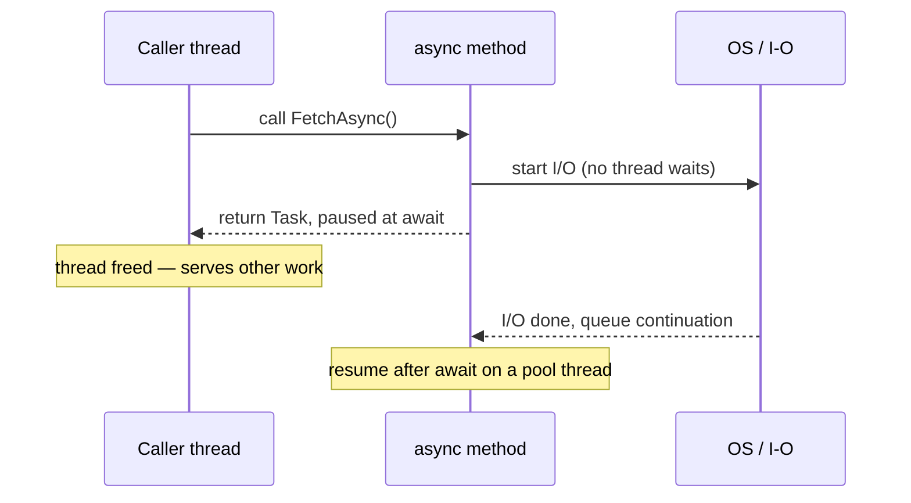

> [!summary]
> `async`/`await` lets **one thread start a slow operation and go do other work instead of standing idle** waiting for it: the method _pauses_ at `await` and _resumes_ when the result is ready. It matters because it's how a server serves thousands of concurrent requests on a handful of threads. It is concurrency, not parallelism — nothing runs faster, the thread just stops waiting.

The C# compiler rewrites your `async` method into a **state machine** — an object that remembers where the method paused and what its local variables were, so it can resume later. Step by step:

1. The method runs **synchronously** until it hits an `await` on something not yet finished.
2. At that `await`, the method **returns to its caller**, handing back a `Task` that means "not done yet." The calling thread is now free to do anything else.
3. The awaited I/O (an HTTP call, a DB query) is handed to the operating system. **No thread sits and waits for it** — for I/O there is _no thread at all_ while the operation is in flight; the OS signals completion (on Windows through an I/O completion port).
4. When the operation completes, the runtime schedules the **continuation** — the rest of your method after the `await` — to run on a thread-pool thread (or back on a captured context; see below).
5. The state machine restores your locals and resumes right after the `await`, as if it had never paused.



The one idea to burn in: **`await` does not create a thread, and for I/O it uses none while waiting.** For **CPU-bound** work the opposite holds — `async` alone won't unblock a tight loop; _you_ must push it onto a thread with `Task.Run`.

```csharp
public async Task<int> CountDotNetAsync(string url)
{
    string html = await _http.GetStringAsync(url); // pause; the thread is freed
    return Regex.Matches(html, @"\.NET").Count;     // resumes when the download completes
}
```

### The context capture (why `ConfigureAwait` exists)

By default, `await` captures the current `SynchronizationContext` (or the current `TaskScheduler` if there's none) and resumes the continuation on it. In a UI app that means resuming on the UI thread — convenient, because you can touch controls. In library code you rarely need it: `await X.ConfigureAwait(false)` skips the capture and resumes on any pool thread, which is faster and dodges a class of deadlocks. ASP.NET Core has **no** `SynchronizationContext`, so there it's moot.

## Pitfalls & trade-offs

- **Blocking on async is a deadlock waiting to happen.** Calling `.Result` or `.Wait()` from a thread that holds a single-threaded `SynchronizationContext` (a UI thread, classic ASP.NET) deadlocks: the continuation needs that context to resume, but you've blocked it waiting for the continuation. Buys a synchronous API at the cost of a hung app. Fix: `await` all the way down. (`GetAwaiter().GetResult()` is _not_ a cure — in a captured context it deadlocks just the same; it only changes exception unwrapping.)
- **`async void` is a trap.** With no `Task` to hold the failure, its exception is raised on the `SynchronizationContext` that was active when it started — not on the caller's `try/catch` — so it usually crashes the process; and it can't be awaited. Only ever for event handlers.
- **`async` is not "faster".** It's about _not blocking_ (throughput, responsiveness), not speed. A CPU-bound loop wrapped in `async` without `Task.Run` still pins the thread.
- **It costs allocations — on the _suspend_ path.** When an `await` actually suspends, the runtime boxes the state machine and allocates a `Task` on the heap. A call that completes synchronously boxes nothing (and the non-generic `Task` is cached and reused). On hot paths that usually finish synchronously, return `ValueTask<T>` to avoid allocating a `Task<T>` — but await a `ValueTask` only **once**.
- **Exceptions are deferred.** A faulted `Task` stores its exception (in `Task.Exception`, an `AggregateException`) and only rethrows it when you `await` it — `await` unwraps and rethrows the first inner exception. Forget to await, and the failure is silently swallowed.

## In production

A web API endpoint that does `await db.QueryAsync(...)`: while the ~20 ms DB round-trip is in flight, that request's thread returns to the pool and serves other requests. The synchronous version instead blocks **one thread per in-flight request**; under load the thread pool is exhausted, new requests queue, latency spikes — _thread-pool starvation_. The same hardware serves far more concurrent users once you stop blocking. In practice, "our API falls over at N concurrent users" is very often fixed by "stop calling `.Result` on async calls."

## Questions

> [!question]- Does `await` block the thread? What actually happens to it?
> No. At an incomplete `await` the method returns to its caller and the thread is released (to the pool, or the UI message loop). For I/O, no thread is used _at all_ while waiting; the OS signals completion and the continuation is queued onto a thread-pool thread (or the captured context).

> [!question]- Why does `.Result` deadlock in a UI / classic-ASP.NET app but not in ASP.NET Core?
> Those hosts install a single-threaded `SynchronizationContext`. `.Result` blocks that one thread; the continuation is posted back to the _same_ context to resume — but it's blocked, so neither side can proceed. ASP.NET Core has no `SynchronizationContext`, so the continuation resumes on a free pool thread and there's no cycle. (Still don't block — it wastes threads.)

> [!question]- You wrap a CPU-heavy loop in an `async` method and `await` it. Is the caller unblocked?
> No. `async` doesn't move work off the thread by itself — code runs synchronously until it awaits something _incomplete_, and a compute loop never does. Offload it explicitly: `await Task.Run(() => Work())`.

> [!question]- `Task.WhenAll` vs `Task.WaitAll` — which and why?
> `WhenAll` returns a `Task` you `await` (non-blocking, composes into other async code). `WaitAll` **blocks** the current thread until all finish and wraps failures in `AggregateException`. Prefer `await Task.WhenAll(...)`.

## Related

- [[Concurrency vs Parallelism]] — async is a concurrency tool, not parallelism.
- [[Threads and the Thread Pool]] — where continuations actually run.
- [[Race Conditions]] and [[Deadlocks]] — the hazards that blocking-on-async creates.

## References

- [Asynchronous programming (C#)](https://learn.microsoft.com/en-us/dotnet/csharp/asynchronous-programming/) — TAP model, `await` semantics, `async void`, `ValueTask`.
- [Asynchronous programming scenarios (C#)](https://learn.microsoft.com/en-us/dotnet/csharp/asynchronous-programming/async-scenarios) — I/O- vs CPU-bound, the state machine, `ConfigureAwait`, `WhenAll`/`WhenAny`, blocking guidance.
- [Async in depth (.NET)](https://learn.microsoft.com/en-us/dotnet/standard/async-in-depth) — why I/O-bound async consumes no thread while waiting.
- [ConfigureAwait FAQ (.NET blog)](https://devblogs.microsoft.com/dotnet/configureawait-faq/) — context capture in depth.
