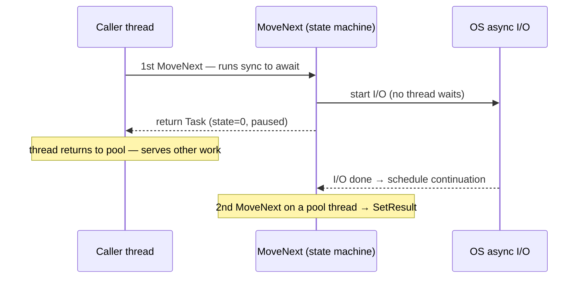

> [!summary]
> `async`/`await` lets **one thread start a slow operation and go do other work instead of standing idle** waiting for it: the method *pauses* at `await`, the thread is released, and the method *resumes* when the result is ready. Under the hood the compiler rewrites the method into a **state machine** and `await` is just a **pattern** (`GetAwaiter`/`IsCompleted`/`GetResult`) the compiler drives.
> It matters because it's how a server serves thousands of concurrent requests on a handful of threads. It is **concurrency, not parallelism** — nothing runs faster; the thread just stops waiting.

## How it works

### The problem it solves: a thread is expensive

The naïve way to wait for I/O is to **block**: the thread calls `socket.Receive()` and sits there, parked by the OS, until bytes arrive. That thread does nothing useful for the ~20 ms of a DB round-trip, yet it still costs ~1 MB of stack and a slot in the thread pool. Serve requests this way and, under load, every pool thread ends up parked on some I/O; new requests have no thread to run on and queue up. This is **thread-pool starvation**, and it's the single most common way a .NET service falls over.

`async`/`await` breaks the "one blocked thread per in-flight wait" coupling. The insight: while an I/O is in flight there is *nothing for a thread to do* — so don't hold one. Hand the operation to the OS, return the thread, and get it (or another) back only when the result is ready.

### I/O-bound vs CPU-bound — the distinction everything hinges on

- **I/O-bound** (network, disk, DB): the work happens *elsewhere* (NIC, disk controller, another machine). `async` shines: **no thread is used at all** while waiting. This is the case `async` was built for.
- **CPU-bound** (a tight loop, hashing, parsing megabytes): the work *is* the thread burning cycles. `async` alone does nothing here — wrapping a compute loop in `async` without offloading still pins the calling thread. To get it off the caller you must **explicitly** push it to the pool with `await Task.Run(() => Work())`.

> [!tip] The one-line test
> Ask "while this waits, is a thread *doing* something?" If **no** (I/O) → `async` frees the thread for free. If **yes** (CPU) → `async` changes nothing; you need `Task.Run` or real parallelism.

### The state machine: what the compiler actually generates

`async` is pure compiler magic — the runtime has no `async` keyword. For every `async` method the C# compiler emits a **state machine**: a type implementing `IAsyncStateMachine` that remembers *where* the method paused and *what its locals were*, so it can resume later.

Concretely it contains:

- an **`int state`** field — which `await` we're parked at (`-1` = running/not started, `-2` = done);
- a **builder** (`AsyncTaskMethodBuilder<T>` for `async Task<T>`, `AsyncValueTaskMethodBuilder<T>` for `ValueTask<T>`, `AsyncVoidMethodBuilder` for `async void`) — the object that owns the returned `Task` and drives completion;
- **hoisted locals** — every local that lives across an `await` becomes a field (so it survives the pause);
- an **awaiter** field for the thing currently being awaited.

All the method's logic moves into a single **`MoveNext()`** method, chopped into segments at each `await`. Take:

```csharp
public async Task<int> CountDotNetAsync(string url)
{
    string html = await _http.GetStringAsync(url);
    return Regex.Matches(html, @"\.NET").Count;
}
```

The compiler produces (heavily simplified, but faithful in shape):

```csharp
private struct StateMachine : IAsyncStateMachine   // a struct in Release, a class in Debug
{
    public int state;
    public AsyncTaskMethodBuilder<int> builder;
    public HttpClient _http;
    public string url;
    private TaskAwaiter<string> awaiter;   // hoisted so it survives the pause

    public void MoveNext()
    {
        int result;
        try
        {
            if (state == 0) goto RESUME;              // second entry: jump past the await

            var task = _http.GetStringAsync(url);
            awaiter = task.GetAwaiter();
            if (!awaiter.IsCompleted)                 // FAST PATH: skip all this if already done
            {
                state = 0;
                builder.AwaitUnsafeOnCompleted(ref awaiter, ref this); // hook continuation, box to heap
                return;                               // <-- method returns here; caller's thread is freed
            }
        RESUME:
            state = -1;
            string html = awaiter.GetResult();        // rethrows here if the task faulted
            result = Regex.Matches(html, @"\.NET").Count;
        }
        catch (Exception ex) { state = -2; builder.SetException(ex); return; }

        state = -2;
        builder.SetResult(result);                    // completes the Task the caller is holding
    }
    // SetStateMachine omitted
}
```

Read `MoveNext` twice and the whole model clicks:

1. **First call** runs synchronously until the `await`. If the awaited thing isn't finished, it saves `state = 0`, tells the builder to invoke `MoveNext` again when the awaiter completes, and **returns** — handing the caller a not-yet-complete `Task`.
2. **Second call** (the *continuation*) jumps straight to `RESUME`, pulls the result with `GetResult()`, finishes the method, and calls `builder.SetResult(...)`, which transitions the returned `Task` to completed and fires *its* continuations.



### `await` is a pattern, not a keyword-bound type

`await` doesn't require `Task`. It works on **anything** exposing the **awaiter pattern** — this is why `ValueTask`, `Task.Yield()`, `IAsyncEnumerable` cursors, and even custom types are awaitable. `await expr` compiles to calls on `expr.GetAwaiter()`, whose returned awaiter must provide:

- **`bool IsCompleted { get; }`** — the fast path. If the result is already available, the compiler skips suspension entirely, calls `GetResult()` inline, and no `Task`/continuation machinery runs. Sync-completing awaits are cheap.
- **`void OnCompleted(Action continuation)`** (via `INotifyCompletion`) — *"call this when you're done."* This is where the awaiter wires the continuation to the underlying signal (an IOCP callback, a timer, another task).
- **`TResult GetResult()`** — hands back the value, or **rethrows** the stored exception with its original stack trace preserved.

In the generated code the compiler actually emits `builder.AwaitUnsafeOnCompleted`, which routes through `ICriticalNotifyCompletion.UnsafeOnCompleted` (the "unsafe" twin of `OnCompleted`): the builder flows `ExecutionContext` itself, so the awaiter needn't re-capture it. `INotifyCompletion.OnCompleted` is the minimal contract; the unsafe variant is the hot path.

So `await` is mechanical: *IsCompleted? → if not, register OnCompleted and return; when signalled, GetResult and resume.* Nothing more mysterious than that.

### What happens to the thread (and why there's often none)

For **real async I/O**, the awaited operation is handed to the OS's async facilities — **I/O completion ports** on Windows, **epoll/kqueue** on Linux — via the runtime's I/O engine. From the moment the request is issued until bytes arrive, **no managed thread is bound to it**. The NIC/disk does the work; the OS raises a completion event; the runtime then grabs a [[Threads and the Thread Pool|thread-pool]] thread to run the continuation (`MoveNext` again).

That is the load-bearing idea:

> [!warning] Burn this in
> **`await` does not create a thread, and for I/O it uses no thread while waiting.** The old mental model — "async runs my method on a background thread" — is wrong and leads to bad code. For CPU work the opposite holds: `async` moves nothing off the thread by itself.

### Continuations, `SynchronizationContext`, and `ConfigureAwait`

When an `await` suspends, the awaiter captures **where to resume**. By default it grabs `SynchronizationContext.Current` (or, if that's null, `TaskScheduler.Current` when it isn't the default scheduler) and posts the continuation back onto it:

- **UI apps (WPF/WinForms)** install a single-threaded `SynchronizationContext` bound to the UI thread. Capturing it means your code after `await` resumes on the UI thread — convenient, because you can touch controls directly.
- **Classic ASP.NET** had a request-bound context. **ASP.NET Core has none** — continuations just run on any pool thread.

`await task.ConfigureAwait(false)` says *"I don't need to resume on the captured context — any pool thread will do."* In library code that's the right default: it's marginally faster (skips the post) and it **dodges the classic sync-over-async deadlock** (below). In app-level UI code where you *do* need the UI thread afterward, leave it capturing.

Two contexts are easy to conflate:

- **`SynchronizationContext`** — *where* the continuation runs. Controlled by `ConfigureAwait`.
- **`ExecutionContext`** — *ambient state* (like `AsyncLocal<T>`, the security/culture context) that **always flows across `await`**, regardless of `ConfigureAwait`. `ConfigureAwait(false)` does **not** stop `AsyncLocal` from flowing.

## Task vs ValueTask

`Task<T>` is a **class** — awaiting an async method that actually suspends allocates one on the heap (plus the boxed state machine). For most code that single allocation is noise. But on **hot paths that usually complete synchronously** (a cache hit, a buffered stream read), allocating a `Task<T>` every call just to say "already done" is pure waste.

`ValueTask<T>` is a **struct** that wraps *either* a ready `T` (zero allocation — the sync path) *or* an underlying `Task<T>`/`IValueTaskSource<T>` (the async path). Return it when the method is *usually* synchronous:

```csharp
public ValueTask<int> ReadAsync()
{
    if (_buffer.TryDequeue(out int v))
        return new ValueTask<int>(v);          // hot path: no allocation
    return new ValueTask<int>(ReadSlowAsync()); // rare path: wraps a real Task
}
```

The catch — `ValueTask` trades allocation for **fragile usage rules**, because the struct may be backed by a pooled/reused source:

- **`await` it at most once.** Awaiting twice is undefined behaviour.
- **Don't** await it concurrently, read `.Result` before it's complete, or stash it in a field. If you need any of that, call `.AsTask()` once and use that.

> [!tip] Rule of thumb
> Return `ValueTask<T>` from *low-level, high-frequency, usually-synchronous* APIs. For ordinary application code, plain `Task<T>` is simpler and safer — reach for `ValueTask` when a profiler says allocations hurt, not by default.

The runtime also softens `Task`'s cost on its own: `AsyncTaskMethodBuilder` **caches** completed tasks for common results (the non-generic completed `Task`, `Task<bool>` for `true`/`false`, small `int`s), so `return true;` from an `async Task<bool>` that finished synchronously allocates nothing. For `ValueTask`-returning async methods, allocation of the backing object can be avoided entirely via the opt-in **`PoolingAsyncValueTaskMethodBuilder`**, which reuses state-machine boxes from a pool.

## Cancellation

Async work is cancelled **cooperatively** — there is no safe way to abort a thread mid-flight, so the *callee* must agree to stop. The tool is `CancellationToken`: you pass one in, and well-behaved async APIs check it.

```csharp
public async Task<string> FetchAsync(string url, CancellationToken ct)
{
    using var resp = await _http.GetAsync(url, ct);   // honours ct: aborts the request
    ct.ThrowIfCancellationRequested();                // your own checkpoints between awaits
    return await resp.Content.ReadAsStringAsync(ct);
}
```

A cancelled operation throws `OperationCanceledException` (its `Task` ends in the `Canceled` state, distinct from `Faulted`) — provided the exception carries the token that was cancelled; an `OperationCanceledException` thrown with an unrelated or absent token surfaces as `Faulted` instead. `TaskCanceledException` derives from it. You create tokens with `CancellationTokenSource` — including `CancelAfter(timeout)` for deadlines. See [[CancellationToken]] for the full model (linked sources, `CancellationTokenRegistration`, timeouts).

## Composing multiple operations

Running independent async operations **together** instead of one-after-another is where async pays off in wall-clock time:

```csharp
var a = FetchAsync(url1, ct);          // start both — don't await yet
var b = FetchAsync(url2, ct);
string[] results = await Task.WhenAll(a, b);   // ~max(a,b), not a+b
```

- **`Task.WhenAll`** returns a `Task` you `await`; it completes when all finish. If several fault, the awaited `WhenAll` **throws only the first** exception — but the returned `Task.Exception` holds them all in an `AggregateException`.
- **`Task.WhenAny`** completes at the first finisher — for timeouts (`await Task.WhenAny(work, Task.Delay(t))`) or fastest-of-N.
- Contrast **`Task.WaitAll`/`WaitAny`**, which **block** the calling thread. Prefer the `When*` variants inside async code; the `Wait*` ones reintroduce the very blocking async exists to avoid.

## Pitfalls & trade-offs

- **Blocking on async is a deadlock waiting to happen (`.Result`/`.Wait()`).** From a thread holding a single-threaded `SynchronizationContext` (a UI thread, classic ASP.NET), `.Result` blocks that thread; the continuation is posted back to that *same* context to resume — but it's blocked, so neither side proceeds. Buys a synchronous API at the cost of a hung app. Fix: `await` all the way down. `GetAwaiter().GetResult()` is **not** a cure — it deadlocks identically; it only changes how exceptions are unwrapped (no `AggregateException`).
- **`async void` is a trap.** With no `Task` to carry the result, its exception is raised on the `SynchronizationContext` active when it started — *not* on the caller's `try/catch` — so it usually crashes the process; and it can't be awaited, so callers can't know when it finished. Only ever for event handlers; everywhere else return `Task`.
- **`async` is not "faster".** It's about *not blocking* — throughput and responsiveness — not raw speed. A CPU-bound loop wrapped in `async` without `Task.Run` still pins the thread; you've added state-machine overhead for nothing.
- **It costs allocations — on the *suspend* path.** When an `await` genuinely suspends, the struct state machine is **boxed** to the heap and a `Task` is allocated. A call that completes synchronously boxes nothing. Hence `ValueTask<T>` and cached tasks for hot, usually-sync paths.
- **Exceptions are deferred and easy to lose.** A faulted `Task` stores its exception and only rethrows it when you `await` (or touch `.Result`). Fire-and-forget a `Task` you never await and the failure is **silently swallowed** — no crash, no log. Never leave a `Task` unobserved.
- **`ValueTask` misuse is silent corruption**, not a loud crash — awaiting twice or reading `.Result` early returns wrong/torn results. Follow the once-only rule or use `Task`.
- **Async all the way, or not at all.** Mixing (`SomeAsync().Result` deep in a sync call tree) is where starvation and deadlocks breed. The contagion is real: one async leaf tends to make the whole call chain async.

## In production

A web API endpoint doing `await db.QueryAsync(...)`: while the ~20 ms DB round-trip is in flight, that request's thread returns to the pool and serves other requests — so a handful of threads absorb thousands of concurrent, mostly-waiting requests. The synchronous version blocks **one thread per in-flight request**; under load the pool is exhausted, new requests queue behind the pool's deliberately slow thread injection — it adds roughly one extra thread per ~500 ms when work isn't draining (a separate hill-climbing heuristic then tunes the steady-state count for throughput) — latency spikes, and the service tips over — **thread-pool starvation**.

The textbook trigger is a single blocking call on a hot path: some helper deep in the stack does `httpClient.GetStringAsync(u).Result`. Each request now consumes a thread *and* blocks it waiting for the continuation that needs a pool thread to run — a self-inflicted feedback loop. In practice, "our API falls over at N concurrent users" is very often diagnosed as, and fixed by, **"stop calling `.Result` on async calls; go async end-to-end."** The same hardware then serves far more concurrent users, because it stopped paying a whole thread to stand and wait.

## Questions

> [!question]- Does `await` block the thread? What actually happens to it?
> No. At an *incomplete* `await`, `MoveNext` saves state and returns to the caller; the thread is released (to the pool, or the UI message loop). For I/O, **no thread is used at all** while waiting — the OS (IOCP/epoll) signals completion and the continuation is queued onto a pool thread (or the captured context). If the awaited thing was *already* complete, there's no suspension: `IsCompleted` is true and execution continues inline on the same thread.

> [!question]- Walk me through what the compiler generates for an `async` method.
> A state-machine type (`IAsyncStateMachine`) with an `int state`, a builder that owns the returned `Task`, hoisted locals, and an awaiter field. The body becomes `MoveNext()`, split at each `await`. `MoveNext` runs to the first incomplete `await`, checks `awaiter.IsCompleted`; if false it saves `state`, calls `builder.AwaitUnsafeOnCompleted` (which boxes the struct to the heap and hooks the continuation) and returns. When the awaiter completes, `MoveNext` is invoked again, jumps past the `await`, calls `GetResult()`, and eventually `builder.SetResult()` to complete the task.

> [!question]- What does `await` actually require of the thing you await?
> The **awaiter pattern**, not `Task` specifically: `expr.GetAwaiter()` returning an awaiter with `bool IsCompleted`, `void OnCompleted(Action)` (`INotifyCompletion`), and `T GetResult()`. It's duck-typed by the compiler, which is why `ValueTask`, `Task.Yield()`, and custom awaitables all work.

> [!question]- Why does `.Result` deadlock in a UI / classic-ASP.NET app but not in ASP.NET Core?
> Those hosts install a single-threaded `SynchronizationContext`. `.Result` blocks that one thread; the continuation is posted back to the *same* context to resume — but it's blocked, so neither can proceed. ASP.NET Core has no `SynchronizationContext`, so the continuation resumes on a free pool thread and there's no cycle. (Still don't block — it wastes threads and invites starvation.) `ConfigureAwait(false)` also breaks the cycle by not requiring the context.

> [!question]- You wrap a CPU-heavy loop in an `async` method and `await` it. Is the caller unblocked?
> No. `async` doesn't move work off the thread by itself — code runs synchronously until it awaits something *incomplete*, and a compute loop never does. Offload it explicitly: `await Task.Run(() => Work())`, which runs it on a pool thread and gives you a `Task` to await.

> [!question]- When would you return `ValueTask<T>` instead of `Task<T>`, and what's the risk?
> When the method **usually completes synchronously** on a hot path (cache hit, buffered read) — `ValueTask<T>` avoids the `Task` heap allocation on that path. Risk: it must be awaited **at most once**, never awaited concurrently, never have `.Result` read before completion, never be cached in a field. Break those and you get silent wrong results. For ordinary code, prefer `Task<T>`.

> [!question]- `Task.WhenAll` vs `Task.WaitAll` — which and why?
> `WhenAll` returns a `Task` you `await` (non-blocking, composes into async code, throws the first exception on await while `Task.Exception` holds all in an `AggregateException`). `WaitAll` **blocks** the calling thread until all finish. Inside async code prefer `await Task.WhenAll(...)`; `WaitAll` reintroduces the blocking async exists to avoid.

> [!question]- What flows across an `await` — and does `ConfigureAwait(false)` stop it?
> `ExecutionContext` (e.g. `AsyncLocal<T>` values) **always flows** across `await`. `SynchronizationContext` determines *where* the continuation resumes and is what `ConfigureAwait(false)` opts out of. So `ConfigureAwait(false)` changes the resume thread but does **not** stop `AsyncLocal` from flowing.

## Related

- [[Concurrency vs Parallelism]] — async is a concurrency tool; it doesn't make anything run in parallel.
- [[Threads and the Thread Pool]] — where continuations actually run, and how pool starvation happens.
- [[Synchronization Primitives]] — `lock`/`SemaphoreSlim`/`Interlocked`; how to guard shared state that async code touches (`SemaphoreSlim.WaitAsync` is the async-friendly one).
- [[CancellationToken]] — cooperative cancellation, timeouts, and registrations.
- [[Race Conditions]] and [[Deadlocks]] — the hazards blocking-on-async and shared mutable state create.

## References

- [Asynchronous programming (C#)](https://learn.microsoft.com/en-us/dotnet/csharp/asynchronous-programming/) — the TAP model, `await` semantics, `async void`, `ValueTask`.
- [Asynchronous programming scenarios (C#)](https://learn.microsoft.com/en-us/dotnet/csharp/asynchronous-programming/async-scenarios) — I/O- vs CPU-bound, the state machine, `ConfigureAwait`, `WhenAll`/`WhenAny`.
- [Async in depth (.NET)](https://learn.microsoft.com/en-us/dotnet/standard/async-in-depth) — why I/O-bound async consumes no thread while waiting.
- [How Async/Await Really Works in C# (.NET blog)](https://devblogs.microsoft.com/dotnet/how-async-await-really-works-in-csharp/) — the generated state machine, builders, and awaiter pattern in depth.
- [Understanding the Whys, Whats, and Whens of ValueTask](https://devblogs.microsoft.com/dotnet/understanding-the-whys-whats-and-whens-of-valuetask/) — when to use it and the usage rules.
- [ConfigureAwait FAQ (.NET blog)](https://devblogs.microsoft.com/dotnet/configureawait-faq/) — context capture, `ExecutionContext` vs `SynchronizationContext`.
