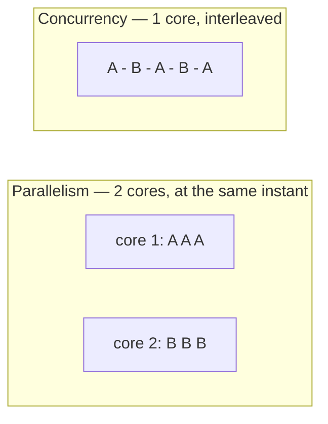

> [!summary]
> **Concurrency** is _dealing with_ many things at once — structuring a program so several tasks are in progress by taking turns (structure and coordination). **Parallelism** is _doing_ many things at once — executing on multiple cores at the same instant. They solve different problems with different tools, and confusing them is how you pick the wrong one and make things slower.

The cleanest framing is Rob Pike's: _"Concurrency is about dealing with lots of things at once. Parallelism is about doing lots of things at once."_

- **Concurrency** decomposes a program into independently-progressing tasks; a scheduler **interleaves** them. On a single core only one runs at any instant, but they take turns via context switches — so multiple things are _in progress_ even though only one _executes_ at a time.
- **Parallelism** runs those tasks at the **same instant on different cores**. It needs actual hardware parallelism (multiple cores).
- The relationship: concurrency is a way to **structure** a program; parallelism is a way to **execute** it. A concurrent design _may_ run in parallel if the runtime and hardware allow — but it doesn't have to, and often shouldn't.

Microsoft's own docs use a kitchen analogy that nails it: cooking breakfast is _"a good example of asynchronous work that isn't parallel. One person (or thread) can handle all the tasks"_ — you start the eggs, then the toast, then flip back. One cook interleaving = concurrency; hiring a second cook = parallelism.

In .NET the split maps to the work type:

- **I/O-bound → concurrency** with `async`/`await`: one thread juggles many in-flight waits. See [[Async/Await]].
- **CPU-bound → parallelism**: `Parallel.For` / `Parallel.ForEach` or PLINQ spread one workload across cores. (`Task.Run` _offloads_ a single computation off the current thread — that's responsiveness; it's only parallelism if you launch several at once.)
- Both sit on top of threads and the [[Threads and the Thread Pool|thread pool]].

## Pitfalls & trade-offs

- **Conflating them picks the wrong tool.** Throwing threads (parallelism) at I/O-bound work wastes them — they just sit blocked; use concurrency (`async`). Wrapping a CPU-bound loop in `async` doesn't speed it up; use parallelism. The "is this I/O-bound or CPU-bound?" question decides which.
- **Concurrency's price is coordination.** The moment tasks share mutable state you get [[Race Conditions|race conditions]] and need [[Locks and Synchronization|synchronization]] — which brings [[Deadlocks|deadlocks]] and contention. Concurrency buys responsiveness and throughput at the cost of having to reason about every interleaving.
- **Parallelism's price is overhead and Amdahl's law.** Threads cost creation and context-switching, and speedup is capped by the _serial_ fraction of the work (Amdahl's law), so 2× cores is rarely 2× speed. Microsoft's docs warn the CPU work may not be "costly enough compared with the overhead of context switches."
- **More parallelism is not more throughput.** Past the core count — or once threads contend on a shared resource (a lock, a disk, a DB connection pool) — adding threads makes it _slower_.

## In production

A web server shows both at once. It needs high **concurrency** — thousands of in-flight requests, most just waiting on a database or downstream service — solved with `async` I/O over a small thread pool, _not_ one thread per request. Inside a single request, generating a heavy report over a big dataset is **CPU-bound** and wants **parallelism** — `Parallel.ForEach`/PLINQ across cores to finish sooner. Same app, both tools: concurrency to stay responsive under many requests, parallelism to crunch one hard computation faster. Picking the wrong one — thread-per-request, or `async`-wrapping a hot loop — is a classic cause of a service that collapses under load.

## Questions

> [!question]- On a single CPU core, can you have concurrency? Parallelism?
> Concurrency: yes — tasks interleave via context switches, so multiple things are in progress even though only one executes at any instant. Parallelism: no — parallelism means _simultaneous_ execution, which requires at least two cores.

> [!question]- A service is slow under load; each request mostly waits on a database. More threads, or async?
> Async (concurrency). The work is I/O-bound, so extra threads would just sit blocked on the DB and exhaust the pool. Async frees the thread during the wait, so a few threads serve many requests. Reach for more threads only when the work is CPU-bound.

> [!question]- Why doesn't doubling the cores double a parallel job's speed?
> Amdahl's law: the serial part (setup, coordination, contention on shared resources) doesn't parallelize and caps the speedup; threads also add scheduling and context-switch overhead. A job that's 20% serial can't beat ~5× no matter how many cores you add.

## Related

- [[Async/Await]] — the concurrency tool for I/O-bound work.
- [[Threads and the Thread Pool]] — the execution units underneath both.
- [[Race Conditions]], [[Locks and Synchronization]], [[Deadlocks]] — the cost of shared mutable state under concurrency.

## References

- [Rob Pike — "Concurrency is not parallelism" (Go blog + talk)](https://go.dev/blog/waza-talk) — the canonical distinction.
- [Asynchronous programming (C#)](https://learn.microsoft.com/en-us/dotnet/csharp/asynchronous-programming/) — the breakfast analogy: async work that isn't parallel.
- [Asynchronous programming scenarios (C#)](https://learn.microsoft.com/en-us/dotnet/csharp/asynchronous-programming/async-scenarios) — the I/O-bound vs CPU-bound decision and multithreading overhead.
- [Task Parallel Library (TPL)](https://learn.microsoft.com/en-us/dotnet/standard/parallel-programming/task-parallel-library-tpl) — data and task parallelism in .NET.
