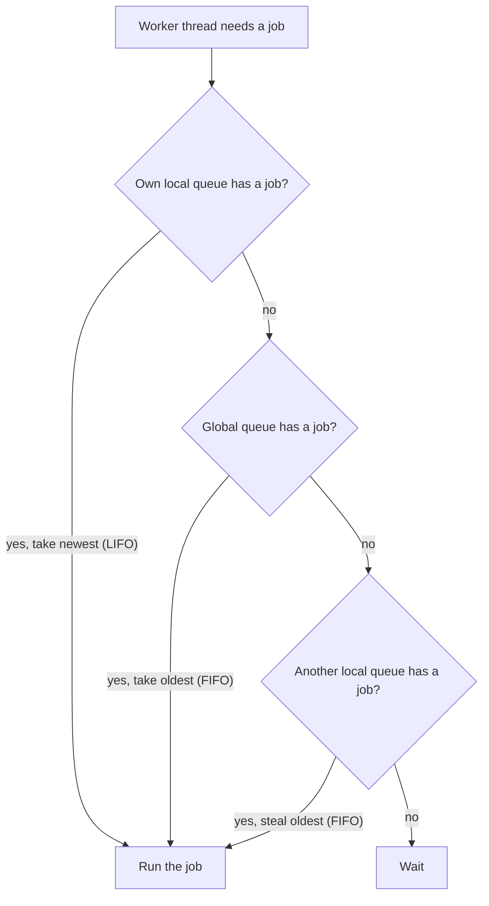

> [!summary]
> A **thread** is what the OS schedules onto a CPU core to run code. A thread is expensive: it holds about 1 MB of stack, it takes a system call to create, and it costs CPU time every time the scheduler moves it on or off a core. Because a thread is expensive, .NET does not create one per job. It keeps a **thread pool**: a fixed set of threads that stay alive and run jobs as they arrive. `Task.Run`, every `await` continuation, and timer and I/O callbacks all run on the pool. The pool's behaviour explains both a service's throughput and its thread-pool starvation.

## The Thread

A CPU core runs code one instruction at a time. It reads an instruction, runs it, then moves to the next. A **thread** is one such stream of instructions, plus the state the OS needs to pause the thread and resume it later. That state is a **stack** (the thread's local variables and call chain) and a set of **registers** (which hold, among other things, the address of the next instruction).

A machine has more threads than cores, so a core cannot run every thread at once. The OS scheduler runs one thread for a short time slice, saves that thread's state, and loads the next thread's state. Saving one thread's state and loading another thread's state is a **context switch**.

## Hardware Threads vs OS Threads

A CPU is often described as "8 cores, 16 threads", and a running process has a third number. On an 8-core laptop, one .NET process can show 40 threads in the debugger. Only a few of those threads run at once. Three separate counts use the word "thread":

- **Cores** are the physical units that execute instructions. This CPU has 8.
- **Hardware threads** are how many instruction streams the CPU runs at the same instant. Each core runs two hardware threads at once (Intel calls this Hyper-Threading; the general term is SMT), so 8 cores give 16 hardware threads. 16 is the limit: at any instant, 16 threads are running and no more.
- **OS threads** are the threads the OS schedules. Their number is not limited to 16. Every thread in the process that is not running is **blocked** (waiting on I/O, a lock, or `Sleep`) or **ready** and waiting for a free core. The scheduler switches these threads across the 16 hardware threads so quickly that the work appears simultaneous.

So 40 OS threads on an 8-core machine is normal. Most of the threads are idle, and the program created few of them. The runtime created the rest: the GC's threads, a finalizer thread, timer threads, and the pool's threads.

## Managed Threads

`new Thread(worker).Start()` makes .NET ask the OS to create a real OS thread, and the OS schedules that thread. A managed thread is a real OS thread, not a cheaper or lighter kind. Creating one costs what creating an OS thread costs.

.NET wraps the OS thread in a `Thread` object because the runtime has to control the thread, and the runtime can only control a thread it created. Three things need that control:

- **Garbage collection.** The GC moves live objects in memory to pack them together, then updates every reference to point at each object's new address. The GC cannot do this while a thread is reading or writing those objects. So the GC pauses every thread first. The GC can pause a thread only at a **safe point** — a point in the code where the runtime knows which registers and stack slots hold object references. The runtime tracks every managed thread so it can pause each thread at a safe point and scan its stack.
- **Identity.** Each managed thread has a `ManagedThreadId`, a number the runtime assigns. This number is not the OS thread's id.
- **Foreground or background.** A **foreground** thread keeps the program running; the program exits only after the last foreground thread finishes. A **background** thread does not keep the program running. `new Thread(...)` creates a foreground thread. Every pool thread is a background thread.

```csharp
var worker = new Thread(Drain);
worker.IsBackground = true;   // this thread will not keep the program running
worker.Start();
```

## Thread Overhead

A thread is one line of code to start, so its cost is easy to miss. There are three costs:

- **Stack memory.** Each thread reserves a stack, 1 MB by default on Windows. 500 threads reserve half a gigabyte of memory before any thread runs a line of work.
- **Startup.** Creating a thread is a system call. The OS allocates the stack, records the thread, and adds the thread to the scheduler. That work is expensive next to a job that finishes in 50 microseconds.
- **Context switching.** Every time the scheduler moves a thread off a core, the machine pays a cost in saved and reloaded state, and in cache data the thread has to reload afterward. The next section explains it.

## Context Switching

A core runs one thread at a time, and there are more runnable threads than cores, so the scheduler constantly moves one thread off a core and puts another thread on. A move happens for one of two reasons. A thread **blocks** — it waits on an I/O call, a lock, or a `Sleep` — and gives up the core. Or the scheduler **preempts** the thread when its time slice ends (a few to tens of milliseconds).

In both cases the kernel saves the running thread's registers and instruction pointer, chooses the next thread, and loads that thread's saved state so the core continues the thread from where it stopped. This save and load costs a microsecond or two.

The larger cost is the cache. A core keeps the data it is using in a small, fast memory on the chip called the **cache**, because reading main memory (RAM) is far slower. While a thread runs, the cache fills with that thread's data. When another thread runs, it replaces that data with its own data. When the first thread runs again, its data is no longer in the cache, so the thread waits while the data is read from RAM. For code that touches a lot of memory, this cost is much larger than the save and load.

This is the real limit on threads. Once the number of runnable threads is greater than the number of hardware threads, the cores spend more of their time switching threads and refilling the cache, and total throughput drops.

## The Thread Pool

A server runs a very large number of tiny jobs: parse a request, run a query callback, resume an `await`. Each job lasts microseconds. Creating a new thread for each job and destroying the thread afterward would cost more than the job itself.

The **thread pool** avoids that cost. .NET keeps a fixed set of worker threads alive. When you give the pool a job, the pool runs the job on a free worker thread. When the job finishes, that worker thread returns to the pool for the next job. No thread is created or destroyed per job.

You do not use the pool directly. You use the APIs built on top of it:

```csharp
Task.Run(() => ResizeImage(upload));   // runs ResizeImage on a pool worker thread
```

A worker thread is shared, not owned by your job. Two rules follow, and each has a pitfall below. Do not block a worker thread for long. Do not store state on a worker thread and read it back later, because the next job on that worker thread is a different job.

## Work Queues

A queued job waits in a queue until a worker thread is free. A single shared queue would work, but every worker thread would take jobs from it under one lock, and on a busy machine that lock becomes the bottleneck.

So the pool keeps two kinds of queue: one **global queue**, and one **local queue per worker thread**. A job submitted from outside the pool (a top-level `Task.Run`) goes on the global queue. A job that a worker thread creates while running another job (a `Task` started inside a pool job) goes on that worker thread's local queue.

A worker thread looks for its next job in a fixed order:

1. **Its own local queue**, taking the newest job first (LIFO). This needs no lock, and the newest job's data is the most likely to still be in the cache.
2. **The global queue**, taking the oldest job first (FIFO), if the local queue is empty.
3. **Another worker thread's local queue**, taking the oldest job (FIFO), only if the global queue is also empty. This step is called **work-stealing**.

Work-stealing is the last step, after the global queue. A worker thread with an empty local queue does not steal a job right away. The worker thread checks the global queue first, and steals only when the global queue is also empty.



## Sizing the Pool

The pool has to decide how many worker threads to keep. Too few, and jobs wait while cores sit idle. Too many, and the machine spends its time on context switches. The pool decides this at runtime.

The pool keeps two kinds of thread: **worker threads** for queued jobs, and **I/O threads** for completed async I/O. `ThreadPool.SetMinThreads(workerThreads, completionPortThreads)` sets a floor for each kind. The floor starts near the number of processors. Above the floor, the pool changes the worker-thread count with two separate mechanisms:

- **Starvation avoidance.** If jobs are queued but the queue is not shrinking, the pool assumes its worker threads are stuck and adds one more worker thread. The pool adds at most one worker thread about every 500 ms.
- **Hill climbing.** Separately, the pool measures how many jobs finish per second, changes the worker-thread count, and keeps the change if more jobs finish.

The 500 ms rate is why a sudden burst of blocking work raises latency: the pool cannot add worker threads quickly. (Since .NET 6 the pool detects some blocking calls and adds threads faster, but you should not depend on it.)

## Async Continuations

This connects to [[Async and Await|async]]. When an `await` suspends on an I/O call, no thread waits during the I/O. When the I/O finishes, the runtime puts the continuation — the code after the `await` — on the pool as a job, and a free worker thread runs it. (In a desktop UI app or old ASP.NET, the continuation instead runs on the captured `SynchronizationContext`, unless the code used `ConfigureAwait(false)`.)

So the pool runs async continuations. "`await` frees the thread" means the worker thread returned to the pool. "Thread-pool starvation" means every worker thread is blocked, so the queued continuations have no worker thread to run them.

## Pitfalls & Trade-offs

**1. Blocking a worker thread starves the pool.**

```csharp
Task.Run(() =>
{
    var user = _repo.LoadUserAsync(id).GetAwaiter().GetResult();   // this worker thread is blocked on the DB call
    SendWelcome(user);
});
```

The worker thread is blocked for the whole database round-trip instead of the microseconds of real work. Under load, every worker thread blocks the same way, and the pool adds worker threads only about twice a second, so the queue of jobs grows. Fix: make the method async and `await` the call, so the worker thread is free while the query runs.

**2. Long-running work does not belong on a worker thread.** A job that runs for minutes, or blocks on a lock or a file, holds a worker thread the whole time. Create a dedicated thread for it instead:

```csharp
Task.Factory.StartNew(PollDeviceForever, TaskCreationOptions.LongRunning);
```

This costs one dedicated OS thread, which is cheaper than holding a pool worker thread that never returns.

**3. Creating a thread per item wastes the pool.**

```csharp
foreach (var row in millionRows)
    new Thread(() => Index(row)).Start();   // one million OS threads
```

This reserves gigabytes of stacks and causes constant context switches. `Task.Run(() => Index(row))` runs the same work on the pool's fixed set of worker threads.

**4. The pool adds threads slowly, so a burst raises latency.** After the service is idle, only the floor of worker threads exists. If 300 CPU-bound jobs arrive at once, most of the jobs wait while the pool adds one worker thread about every 500 ms. If the load is this bursty, raise the floor:

```csharp
ThreadPool.SetMinThreads(workerThreads: 200, completionPortThreads: 200);
```

The cost: those worker threads stay alive and add context-switch cost when the load is low. Raise the floor when a profile shows you need it, not by default.

**5. Worker threads run at the same time, so shared state races.** Many jobs run on many worker threads at once. Any mutable state the jobs share is a [[Race Conditions|race condition]] and needs a [[Synchronization Primitives|lock]] or `Interlocked`.

```csharp
var counts = new Dictionary<string, int>();
Parallel.ForEach(events, e => counts[e.Type]++);   // Dictionary is not thread-safe: this corrupts it
```

**6. A `[ThreadStatic]` value does not survive an `await`.** After the `await`, a different worker thread may run the continuation, so a value stored in `[ThreadStatic]` before the `await` may be missing after it.

```csharp
[ThreadStatic] static string _correlationId;
_correlationId = ctx.Id;
await _next(ctx);
Log(_correlationId);   // may be null: a different worker thread resumed here
```

Use `AsyncLocal<T>` instead. `AsyncLocal<T>` follows the async call across `await`, not the thread.

## In Production

A checkout endpoint calls a payment gateway. With one tester, the endpoint is fast. Under a sales spike, the endpoint times out, and a larger server does not fix it.

```csharp
[HttpPost("checkout")]
public IActionResult Checkout(Cart cart)
{
    var result = _gateway.ChargeAsync(cart).Result;   // this worker thread is blocked for ~300 ms
    return Ok(result);
}
```

The gateway call takes about 300 ms. Each request blocks one worker thread for that whole time. At a few hundred concurrent checkouts, every worker thread is blocked, and new requests wait behind the pool's rate of about two new worker threads per second. Response times rise from 300 ms to several seconds. The load balancer's health checks then fail, so the load balancer removes instances and sends their traffic to the remaining instances, which blocks their worker threads faster. A single blocking `.Result` call turns a traffic spike into an outage.

```csharp
[HttpPost("checkout")]
public async Task<IActionResult> Checkout(Cart cart)
{
    var result = await _gateway.ChargeAsync(cart);   // the worker thread returns to the pool during the call
    return Ok(result);
}
```

Now each worker thread is busy only for the microseconds around the call, not the 300 ms of waiting, so a few worker threads handle thousands of concurrent checkouts. Raising `SetMinThreads` can help during the incident, but the cause is the blocking `.Result` call, and only removing that call fixes the system.

## Questions

> [!question]- A machine has 8 cores but the process shows 40 threads. How?
> "8 cores, 16 threads" describes the hardware: 8 physical cores, and each core runs two hardware threads at once through SMT, so 16 threads run at the same instant. 16 is the ceiling. The 40 are OS threads, and their number is not limited to 16. At any instant a few threads run, and the other threads are blocked (waiting on I/O, a lock, or `Sleep`) or ready and waiting for a free core. The scheduler switches them across the 16 hardware threads. Most of the 40 threads are idle, and the runtime created many of them: the GC, the finalizer thread, timers, and the pool.

> [!question]- Is a managed thread cheaper than an OS thread? What does .NET add?
> No. `new Thread()` asks the OS to create a real OS thread, so a managed thread costs the same. .NET tracks the thread because the runtime has to control it. The GC moves objects and updates references, so it must pause each thread at a safe point and scan the thread's stack, which it can do only for a thread it created. Each thread has a `ManagedThreadId` that is not the OS thread's id. And each thread is foreground or background, which decides whether the thread keeps the program running.

> [!question]- Where is the real cost of a context switch?
> Not the save and load of the registers, which costs a microsecond or two. The larger cost is the cache. The incoming thread replaces the outgoing thread's data in the cache, so when the outgoing thread runs again it waits while its data is read from RAM. For code that touches a lot of memory, this cost is much larger than the switch, and it is why running more threads than the hardware-thread count lowers throughput.

> [!question]- A worker thread's local queue is empty. Where does it look next?
> The global queue, not another worker thread's queue. The order is: the worker thread's own local queue (newest first, LIFO), then the global queue (oldest first, FIFO), then another worker thread's local queue (oldest first, FIFO). Work-stealing is the last step and happens only when the global queue is also empty. Assuming a worker thread steals as soon as its own queue is empty is the common mistake.

> [!question]- Why does one blocking `.Result` on a hot path take down a service under load?
> The `.Result` call blocks one worker thread for the whole wait instead of the microseconds of real work. Under load, every request blocks a worker thread the same way. New requests, and the continuations that would free the blocked worker threads, have no worker thread to run on, and the pool adds worker threads only about twice a second. The queue of jobs grows without limit and latency rises sharply. This is thread-pool starvation.

> [!question]- The pool has "starvation avoidance" and "hill climbing." What does each do?
> Starvation avoidance adds worker threads when jobs are queued but not draining: it adds about one worker thread every 500 ms, in case the worker threads are stuck. Hill climbing measures how many jobs finish per second and moves the worker-thread count toward the count that finishes the most jobs. Starvation avoidance reacts to blocked worker threads; hill climbing tunes for throughput. Both run at the same time.

## Related

- [[Async and Await]]. Async continuations and I/O completions run on this pool; starvation is the pool running dry.
- [[Concurrency vs Parallelism]]. The pool gives parallelism across cores; async gives concurrency without threads.
- [[Synchronization Primitives]]. `lock`, `SemaphoreSlim`, `Interlocked` for the shared state pool worker threads touch.
- [[Race Conditions]] and [[Deadlocks]]. The hazards of many worker threads running at once.

## References

- [Managed and unmanaged threading in Windows (.NET)](https://learn.microsoft.com/en-us/dotnet/standard/threading/managed-and-unmanaged-threading-in-windows). The managed-to-OS-thread relationship and `ManagedThreadId`.
- [Foreground and background threads (.NET)](https://learn.microsoft.com/en-us/dotnet/standard/threading/foreground-and-background-threads). Which threads keep the process alive.
- [The managed thread pool (.NET)](https://learn.microsoft.com/en-us/dotnet/standard/threading/the-managed-thread-pool). Queuing work, worker vs completion-port threads, min/max.
- [Debug thread pool starvation (.NET)](https://learn.microsoft.com/en-us/dotnet/core/diagnostics/debug-threadpool-starvation). The starvation symptom and the ~500 ms injection.
- [.NET ThreadPool starvation, and how queuing makes it worse (Criteo)](https://medium.com/criteo-engineering/net-threadpool-starvation-and-how-queuing-makes-it-worse-512c8d570527). The local and global queues and the work-stealing order.
